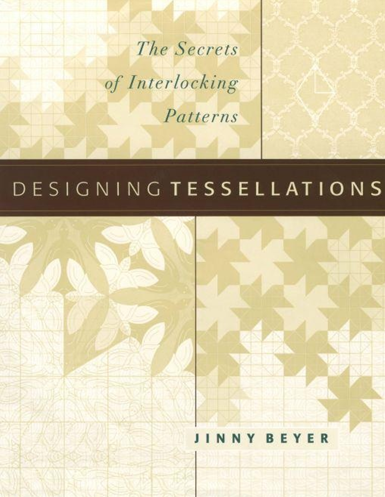

---
categories:
    - Books
tags:
    - Illustrations
    - Design how to
    - Patterns
    - Symmetry
    - Wallpaper Groups
readtime: 5
---
# Designing tessellations: The Secrets of Interlocking Patterns by Jinny Beyer

{width="200"}

This is a very good book for anyone interested in designing tessellations and interlocking patterns. The author, Jinny Beyer, is a well-known quilter and designer, and she provides a wealth of information on the subject. She has been teaching and designing for over 30 years, and her expertise shines through in this book.

Unlike many other books on the subject, this one is not just a collection of patterns. Instead, it focuses on the principles of design and how to create your own unique tessellations. The author provides clear explanations and step-by-step instructions for creating wallpaper-patterns.

Even though she is not a mathematician, she has a good understanding of the mathematical principles underlying tessellations and patterns. She explains these concepts in a way that is accessible to readers without a strong math background.

I enjoyed this book a lot.

## Table of Contents

Title Page
Copyright Page
Dedication
Introduction
Acknowledgements

### CHAPTER 1 - What Are Tessellations?

    From Simple Tessellations to Escher-Type Designs
    Symmetry and Tessellations

### CHAPTER 2 - An Introduction to Symmetry

    Pattern
    Types of Symmetry
    Ways to Generate Symmetrical Patterns

### CHAPTER 3 - Desining with Two-Dimensional Symmetries: The FirstEleven ...

    Working with Symmetries
    Multiple Patterns from a Single Cell

### CHAPTER 4 - Designing with Two-Dimensional Symmetries: The Last Six Symmetry Groups

    12. Traditional Block (p4m) Symmetry
    13. Three Rotation (p3) Symmetry
    14. Six Rotation (p6) Symmetry
    15. Mirror and Three-Rotation (p3m1) Symmetry
    16. Three Rotations and a Mirror (p31m) Symmetry
    17. Kaleidoscope (p6m) Symmetry
    Summary of Two-Dimensional Symmetry Groups

### CHAPTER 5 - Designing with Linear Symmetry Groups

    The Seven Linear Symmetry Groups
    The Linear Symmetry Groups

### CHAPTER 6 - Experimenting with Symmetry

    Applying Other Symmetries to the Primary Cell
    Designing Your Own Primary Cell
    Symmetry Breaking

### CHAPTER 7 - The Keys to Creating Interlocking Tessellations

    Creating Interlocking Shapes
    Combining Operations
    Tessellating Borders
    Endless Design Possibilities

### CHAPTER 8 - Refining Tessellations: Shape and Color

    Preparing Tessellations for Construction in Surface Design
    Preparing Tessellations for Color and Value
    Design Options for All Media

### CHAPTER 9 - Creating Geometric Tessellations

    Tessellations for All Surface Designers
    The Miraculous Effects of Value and Contrast

### CHAPTER 10 - Creating Representational Tessellations

    Escher’s Vision
    Escher’s Techniques
    Making Representational Tessellations
    Multimotif Designs
    Experimenting with Multimotif Designs

### CHAPTER 11 - Metamorphosis

    Moving from One Geometric Shape to Another
    Moving from Geometric Shapes to Representational Images
    Escher’s Legacy

### Appendix
    Appendix A
    Appendix B
    Appendix C

Credits