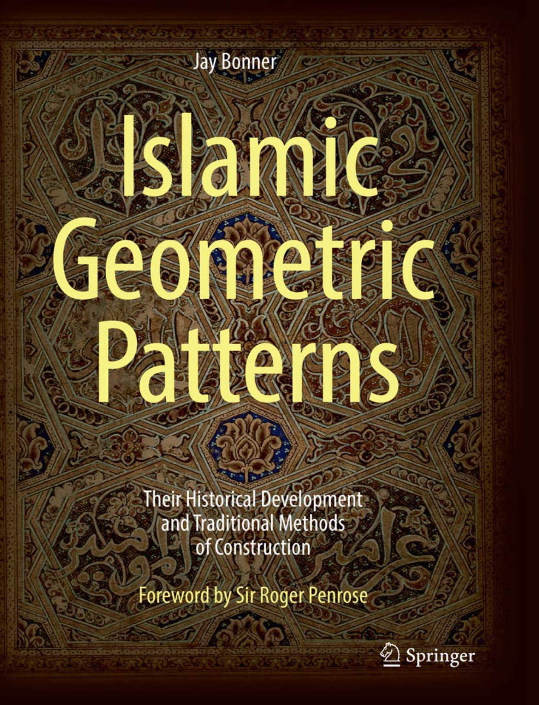
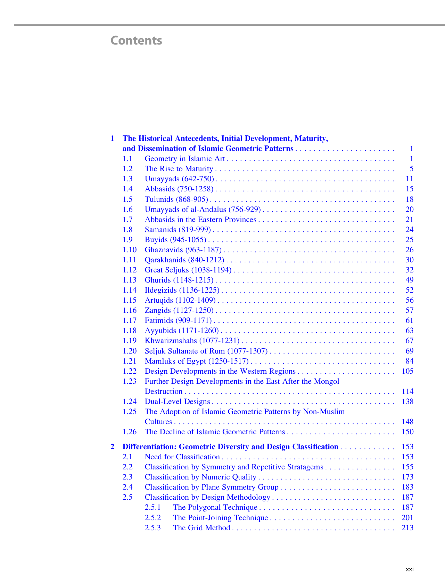
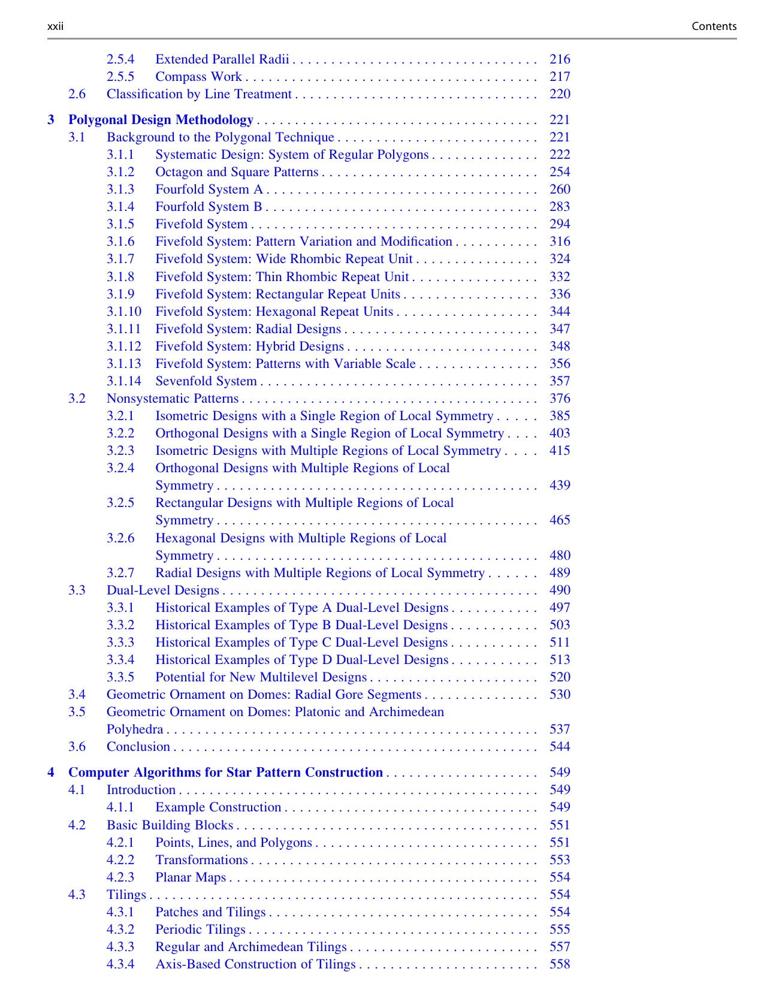
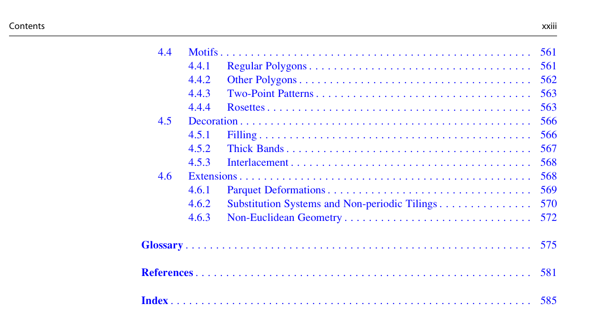

---
categories:
    - Books
tags:
    - Illustrations
    - Historic Patterns
    - IGP
    - Symmetry
    - How to Draw
readtime: 5
---

 # Islamic Geometric Patterns
 ## Their Historical Development and Traditional Methods of Construction
 ## by Jay Bonner and Craig S. Kaplan

{width="200"}

{width="500"}
{width="500"}
{width="500"}
