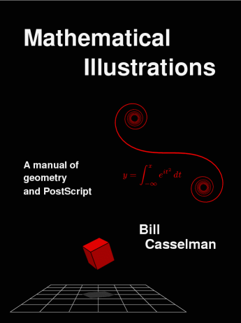

---
categories:
    - Books
tags:
    - Illustrations
    - Postscript
    - Math
readtime: 5
---
# Mathematical Illustrations by Robert Casselman

{width="200"}

This is the best introduction to PostScript I have ever seen. It is a bit old, but it is still relevant. The book is well-structured and covers a wide range of topics, including basic drawing, coordinate transformations, curves, and 3D graphics. The author provides clear explanations and examples, making it easy to follow along. The book also includes exercises and code snippets to help reinforce the concepts learned.

The author, Robert Casselman, is a mathematician and computer scientist who has a deep understanding of the subject matter. He presents the material in a way that is both engaging and informative. The book is suitable for anyone interested in learning about mathematical illustrations and PostScript programming.

Even if you don't have a specific interest in PostScript, this book is a great resource for anyone looking to improve their understanding of mathematics and computer graphics. The author provides a wealth of information and insights that are applicable to a wide range of fields.

The book is [available for free online](https://personal.math.ubc.ca/~cass/graphics/manual/).

## Table of Contents

### Chapter 1. Getting started in PostScript

1. Simple drawing 2
2. Simple coordinate changes 7
3. Coordinate frames 9
4. Doing arithmetic in PostScript 11
5. Errors 14
6. Working with files and viewers GhostView or GSView 16
7. Some fine points 19
8. A trick for eliminating redundancy 22
9. Summary 22
10. Code 24

### Chapter 2. Elementary coordinate geometry 26

1. Points and vectors 26
2. Areas of parallelograms 27
3. Lengths 32
4. Vector projections 34
5. Rotations 37
6. The cosine rule 39
7. Dot products in higher dimensions 41
8. Lines 41
9. Code 44

### Chapter 3. Variables and procedures 46

1. Variables in PostScript 46
2. Procedures in PostScript 48
3. Keeping track of where you are 50
4. Passing arguments to procedures 52
5. Procedures as functions 54
6. Local variables 55
7. A final improvement 57

### Chapter 4. Coordinates and conditionals 59

1. Coordinates 59
2. How PostScript stores coordinate transformations 62
3. Picturing the coordinate system 65
4. Moving into three dimensions 67
5. How coordinate changes are made 71
6. Drawing infinite lines: conditionals in PostScript 73
7. Another way to draw lines 78
8. Clipping 81
9. Order counts 82
10. Code 83

### Chapter 5. Drawing polygons: loops and arrays 84

1. The repeat loop 84
2. The for loop 86
3. The loop loop 87
4. Graphing functions 87
5. General polygons 88
6. Clipping polygons 90
7. Code 94

### Chapter 6. Curves 95

1. Arcs 95
2. Fancier curves 96
3. Bezier curves ´ 97
4. How to use Bezier curves ´ 100
5. The mathematics of Bezier curves ´ 108
6. Quadratic Bezier curves ´ 109
7. Mathematical motivation 110
8. Weighted averages 113
9. How the computer draws Bezier curves ´ 116
10. Bernstein polynomials 118
11. This section brings you the letter O 120

Interlude 123

### Chapter 7. Drawing curves automatically: procedures as arguments 126

1. Drawing an hyperbola 126
2. Parametrized curves 130
3. Drawing graphs automatically 131
4. Drawing parametrized paths automatically 133
5. How to use it 135
6. How it works 137
7. Code 138

### Chapter 8. Non-linear 2D transformations: deconstructing paths 140

1. Two dimensional transformations 140
2. Conformal transforms 144
3. Transforming paths 145
4. Maps 146
5. Fonts want to be free 150
6. Code 150
Chapter 9. Recursion in PostScript 153
1. The perils of recursion 153
2. Sorting 155
3. Convex hulls 159

### Chapter 10. Perspective and homogeneous coordinates 165

1. The projective plane 167
2. Boy’s surface 169
3. Projective transformations 171
4. The fundamental theorem 172
5. Projective lines 175
6. A remark about solving linear systems 176
7. The GIMP perspective tool, revisited 179
8. Projections in 2D 180
9. Perspective in 3D 181

### Chapter 11. Introduction to drawing in three dimensions 185

### Chapter 12. Transformations in 3D 187

1. Rigid transformations 187
2. Dot and cross products 189
3. Linear transformations and matrices 195
4. Changing coordinate systems 198
5. Rigid linear transformations 201
6. Orthogonal transformations in 2D 202
7. Orthogonal transformations in 3D 204
8. Calculating the effect of an axial rotation 207
9. Finding the axis and angle 209
10. Euler’s Theorem 210
11. More about projections 211

### Chapter 13. PostScript in 3D 212

1. A survey of the package 213
2. The 3D graphics environment 217
3. Coordinate transformations 219
4. Drawing 221
5. Surfaces 222
6. Code 223

### Chapter 14. Drawing surfaces in 3D 225

1. Faces 225
2. Polyhedra 227
3. Visibility for convex polyhedra 229
4. Shading 231
5. Smooth surfaces 235
6. Smoother surfaces 239
7. Abandoning convexity 244
8. Summary 249
9. Code 250

### Chapter 15. The regular polyhedra 252

1. What exactly is a regular polyhedron? 253
2. There are no more than five regular solids 254
3. The proof of Euclid XI.21 258
4. Trihedral angles 261
5. The results we need from Book I 263
6. Constructing the regular polyhedra 265
7. Verifying regularity 269
8. Code 269
9. References 272

### Appendix 1. Summary of PostScript commands 274

1. Mathematical functions 274
2. Stack operations 275
3. Arrays 276
4. Dictionaries 277
5. Conditionals 277
6. Loops 278
7. Conversions 279
8. File handling and miscellaneous 279
9. Display 280
10. Graphics state 281
11. Coordinates 282
12. Drawing 283
13. Displaying text 284
14. Errors 285
15. Alphabetical list 285

### Appendix 2. Setting up your PostScript environment 288

1. Editing PostScript files 288
2. Running external files 289
3. Making images 290
4. Printing files 291

### Appendix 3. Structured PostScript documents 293

### Appendix 4. Simple text display 296

1. Simple PostScript text 296
2. Outline fonts 298

### Appendix 5. Zooming 300

1. Zooming 300
2. An explicit procedure 301
3. Playing around 302
4. Code 303

### Appendix 6. Evaluating polynomials: getting along without variables 304

1. The most straightforward way to do it 304
2. Horner’s method 305
3. Evaluating the derivatives efficiently 307
4. Evaluating Bernstein polynomials 309
5. Code 310

### Appendix 7. Importing PostScript files 311

1. Labelling a graph 311
2. Importing TEX text 315
3. Fancy work 317

Epilogue 321
