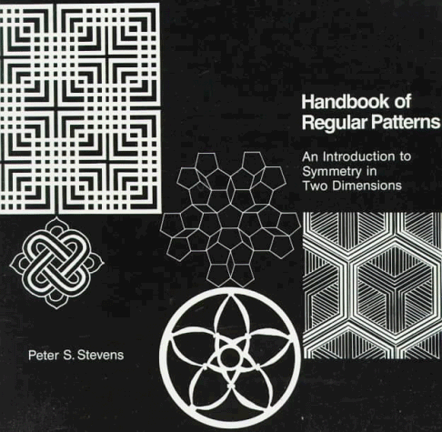

---
categories:
    - Books
tags:
    - Illustrations
    - Patterns
    - Frieze Groups
    - Wallpaper Groups
    - Symmetry
readtime: 5
---

# Handbook of regular patterns: An introduction to symmetry in two dimensions by Peter S. Stevens (Author)

{width="200"}

<!-- more -->

This book explores symmetry and pattern structures across different cultures and periods. It covers a wide range of topics, including symmetry groups, frieze patterns, wallpaper groups, and the mathematical principles underlying these concepts. The book is well-illustrated and includes many examples and exercises to help readers understand the material. Extensive coverage of historic examples of Frieze groups.

## Table of Contents:

I. Symmetry Groups

1. Basic Operations - 2
2. How Operations Generate Themselves - 10

II. Point Groups

3. Point Groups - 18
4. The Asymmetric Motif: Group 1 - 22
5. Bilateral Symmetry: Group m - 28
6. Playing Cards and Walnuts: Groups 2 and 2mm - 38
7. The Triskelion and the Green Pepper: Groups 3 and 3m - 52
8. The Swastika and the Greek Cross: Groups 4 and 4mm - 58
9. Flowers and Pentagrams: Groups 5 and 5m - 72
10. Solomon’s Seal and Snowflakes: Groups 6 and 6mm - 80
11. Stars and Circles: Point Groups of Higher Order - 84

III. The Seven Line Groups

12. Ducks in a Row: Group t - 96
13. Friday’s Footprints: Group tg - 106
14. Reflected Reflections: Group tm - 118
15. Reflected Sails: Group mt - 126
16. Grand Right and Left: Group f2 - 136
17. Reflected Whirls: Group t2mg - 148

IV. The Seventeen Plane Groups

18. Linear Kaleidoscope: Group t2mm - 158
19. Recapitulation - 166
20. Two Nonparallel Translations: Group p1 - 170
21. Two Parallel Glide Reflections: Group pg - 182
22. Two Parallel Mirrors: Group pm - 192
23. A Reflection and a Parallel Glide Reflection: Group cm - 198
24. Four Half-Turns: Group p2 - 208
25. A Mirror and a Perpendicular Glide Reflection: Group p2mg - 218
26. Two Perpendicular Glide Reflections: Group p2gg - 230
27. Reflections in Four Sides of a Rectangle: Group p2mm - 242
28. Perpendicular Mirrors and Perpendicular Glide Reflections: Group c2mm - 248
29. Three Rotations Through 120°: Group p3 - 258
30. Reflections in an Equilateral Triangle: Group p3m1 - 264
31. Reflections of 120° Turns: Group p31m - 272
32. Quarter-Turns: Group p4 - 280
33. Reflections of Quarter-Turns: Group p4gm - 290
34. Reflections in the Sides of a 45°-45°-90° Triangle: Group p4mm - 302
35. Sixfold Rotations: Group p6 - 314
36. Reflections in the Sides of a 30°-60°-90° Triangle: Group p6mm - 324
37. Summary - 332

Appendix
Derivations and the Absence of Group p5 - 376

Bibliography - 392
Index - 394