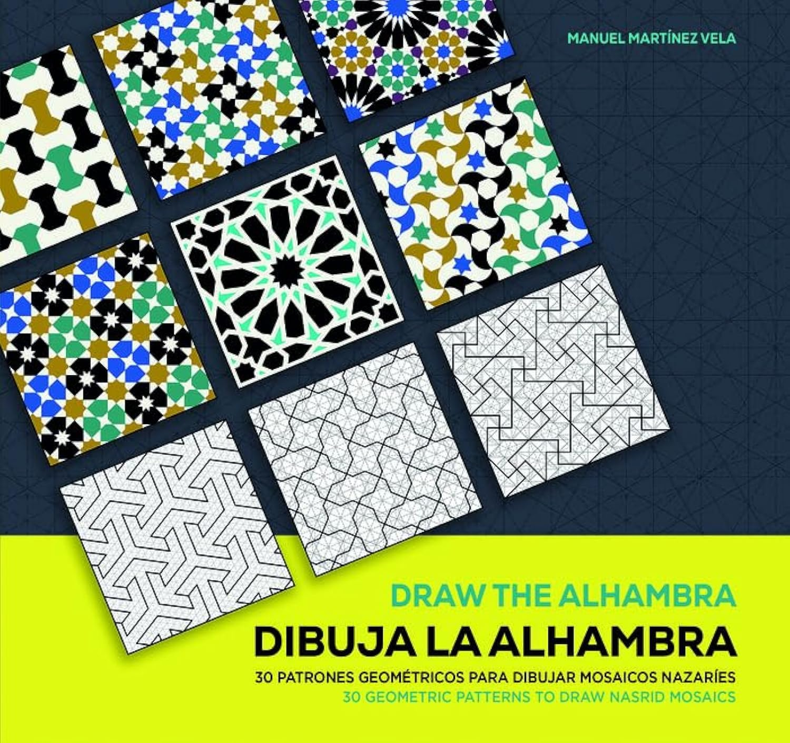

---
date:
   created: 2025-01-07
categories:
    - Books
tags:
    - Illustrations
    - Historic Patterns
    - IGP
    - Symmetry
    - How to Draw
readtime: 5
---

# How to Draw the Mozaics of the Alhambra by Manuel Martínez Vela

{width="200"}

<!-- more -->

This is another excellent book about Islamic geometric patterns, focusing on the Alhambra palace in Granada, Spain. It is a how to draw book filled with whole page illustrations with step by step instructions. I have the English version. The book is a treasure trove of information for anyone interested in Islamic art, geometry, or the history of the Alhambra.

The book covers almost every room in the Alhambra palace, and it is a great resource for anyone interested in learning the symmetries of the period (the palace built between 1238 and 1358). It is beautifully illustrated with high-quality images and diagrams that help to explain the complex geometric patterns.