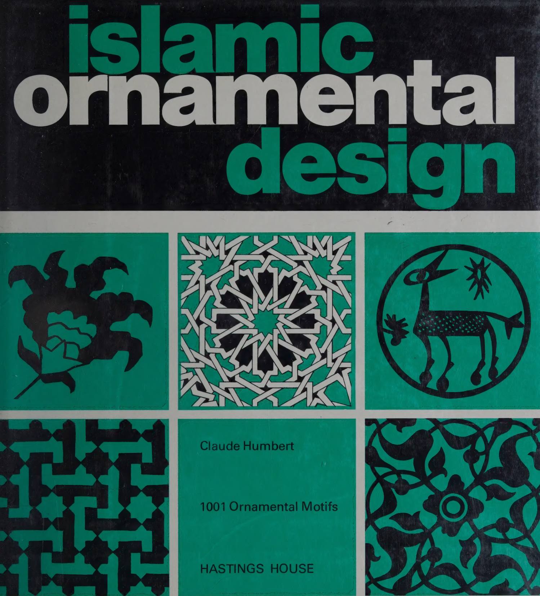
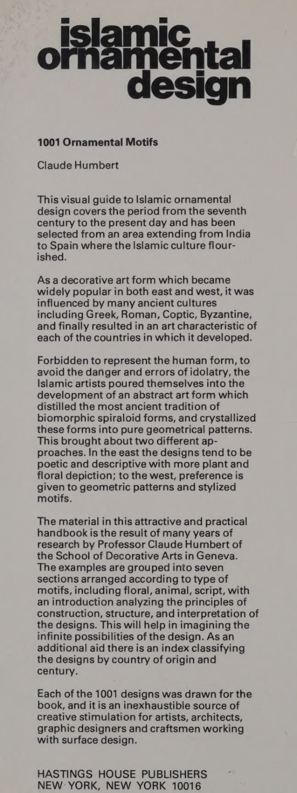
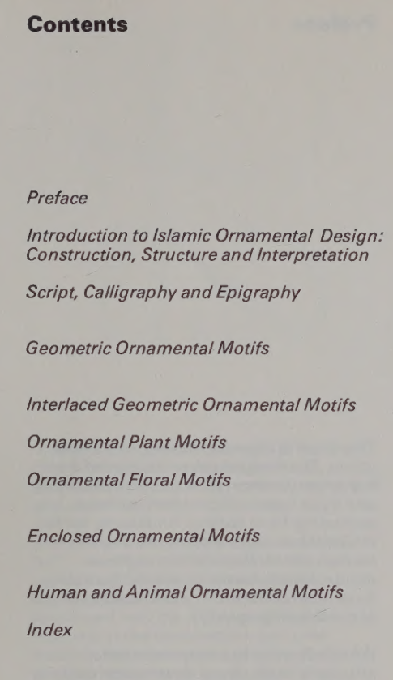

---
categories:
    - Books
tags:
    - Illustrations
    - Patterns
    - Symmetry
    - Wallpaper Groups
    - Frieze Groups
    - History
readtime: 5
---
# Islamic Ornamental Design by Claude Humbert

{width="200"}

This book has over 1000 hand-drawn illustrations of Islamic patterns. It is a great resource for anyone interested in historic art and design. Each drawing is accompanied by a brief description of the location and date of the original work in English, French, and German. The book is well-organized and easy to navigate, making it a valuable reference for artists, designers, and historians alike.

Inside jacket:

{width="400"}
{width="300"}