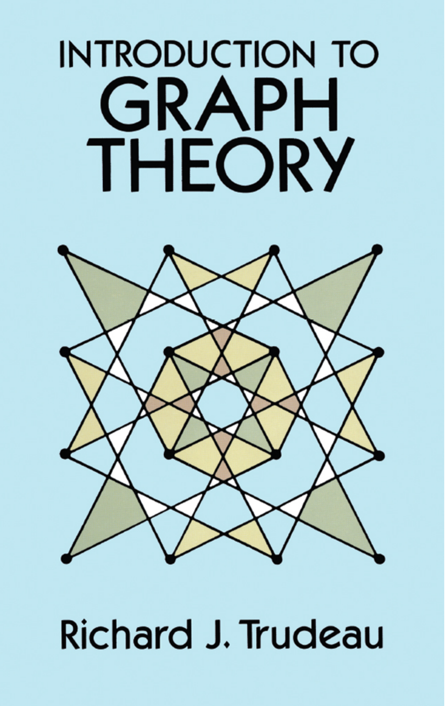

---
categories:
    - Books
tags:
    - Math
    - Graph Theory
readtime: 5
---

# Introduction to Graph Theory by  Richard J. Trudeau

{width="200"}

<!-- more -->

This is a classic book on graph theory that provides a comprehensive introduction to the subject. It covers a wide range of topics, including basic concepts, algorithms, and applications. The book is well-written and easy to understand, making it suitable for both beginners and more advanced readers.
It includes many examples and exercises to help readers understand the material, and it is a great resource for anyone interested in learning about graph theory.
