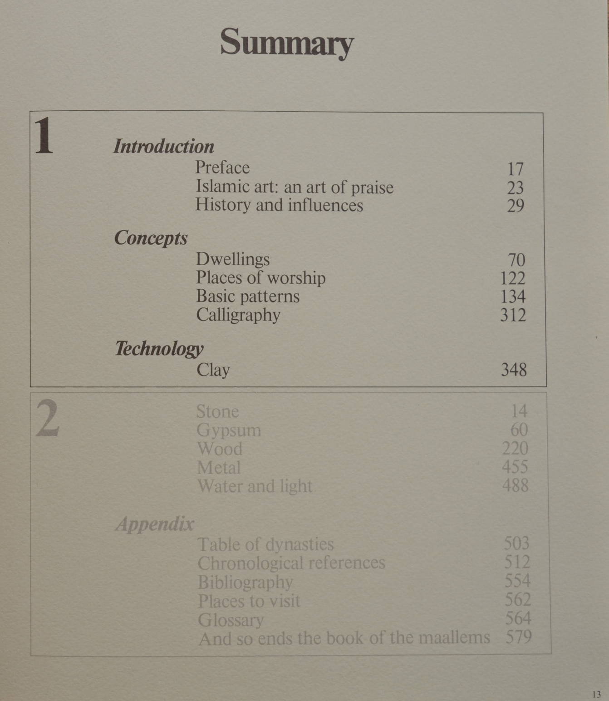

---
categories:
    - Books
tags:
    - Historic Patterns
    - IGP
    - Morrocco
readtime: 5
---

# Traditional Islamic Craft in Moroccan Architecture (Vol.1 & 2) by Andre Paccard

{width="200"}

<!-- more -->

This is a two-volume set that provides a comprehensive overview of the traditional Islamic craft in Moroccan architecture. The books are filled with high-quality pictures that help to explain the complex geometric patterns and designs found in Moroccan architecture. The author, Andre Paccard, is an expert in the field and has spent many years studying and documenting the intricate details of Moroccan architecture.

{width="500"}

{width="400"}
{width="400"}