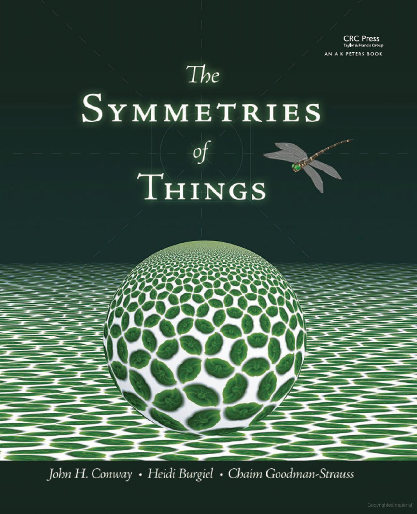

---
categories:
    - Books
tags:
    - Math
    - Reference
    - Patterns
    - Tilings
    - Illustrations
    - Frieze Groups
    - Wallpaper Groups
    - Color Symmetry
    - Hyerbolic Tilings
readtime: 5
---

# The Symmetries of Things by John H. Conway, Heidi Burgiel, and Chaim Goodman-Strauss

{width="200"}

<!-- more -->

This book is one of the rare books that covers the topic of symmetry in a comprehensive and accessible way. It is written by three experts in the field and includes many illustrations and examples to help readers understand the concepts. The book covers a wide range of topics, including symmetry groups, tilings, colorings of patterns, and the classification of patterns to list a few. It is a great resource for anyone interested in the mathematics of symmetry.

While most books approach symmetry primarily through group theory, this one takes a dual perspective, exploring symmetry through both topology and group theory. It serves as an excellent resource for anyone interested in the mathematics of symmetry and its applications in art and design. The book embodies the unique and unmistakable style of the late English mathematician John Horton Conway (December 26, 1937 – April 11, 2020), renowned for his playful and engaging approach to mathematics.

## Table of Contents

### **Part I: Symmetries of Finite Objects and Plane Repeating Patterns**
1. Symmetries
2. Planar Patterns
3. The Magic Theorem
4. The Spherical Patterns
5. The Seven Types of Frieze Patterns
6. Why the Magic Theorems Work
7. Euler’s Map Theorem
8. Classification of Surfaces
9. Orbifolds

### **Part II: Color Symmetry, Group Theory, and Tilings**
10. Presenting Presentations
11. Twofold Colorations
12. Threefold Colorings of Plane Patterns
13. Other Primefold Colorings
14. Searching for Relations
15. Types of Tilings
16. Abstract Groups

### **Part III: Repeating Patterns in Other Spaces**
17. Introducing Hyperbolic Groups
18. More on Hyperbolic Groups
19. Archimedean Tilings
20. Generalized Schlafli Symbols
21. Naming Archimedean and Catalan Polyhedra and Tilings
22. The 35 “Prime” Space Groups
23. Objects with Prime Symmetry
24. Flat Universes
25. The 184 Composite Space Groups
26. Higher Still

### **Appendix**
- Other Notations for the Plane and Spherical Groups

{align=left width="200"}
{align=left width="200"}
{width="200"}
