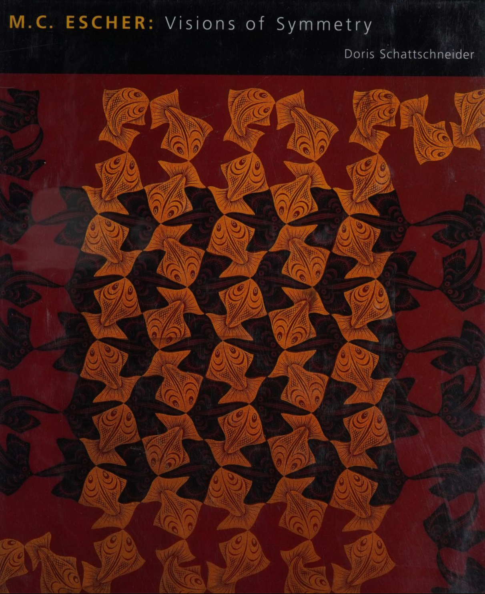

---
categories:
    - Books
tags:
    - Illustrations
    - Patterns
    - Symmetry
    - Wallpaper Groups
    - Escher
readtime: 5
---
# M.C. Escher : Visions of Symmetry by Doris Schattschneider

{width="200"}

This book documents the evolution of Escher's work and the mathematical ideas that inspired him. It has very interesting details about the artist's life and work, and parallels between his work and the work of the mathematicians who were active in the same period.

Escher's "Regular Division of the Plane" (Regelmatige Vlakverdeling in Dutch)is presented in its entirety, and the book provides a good overview of the mathematical concepts behind it. The author, Doris Schattschneider, spent more than 15 years to research and write this book, and it shows.

This is the second edition of the book. It is identical to the first edition with the exception of the 20 page `Afterword` which covers more recent developments about Escher's work.

{width="500"}