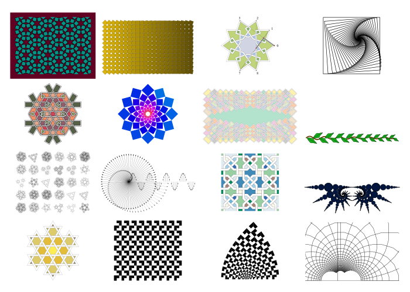
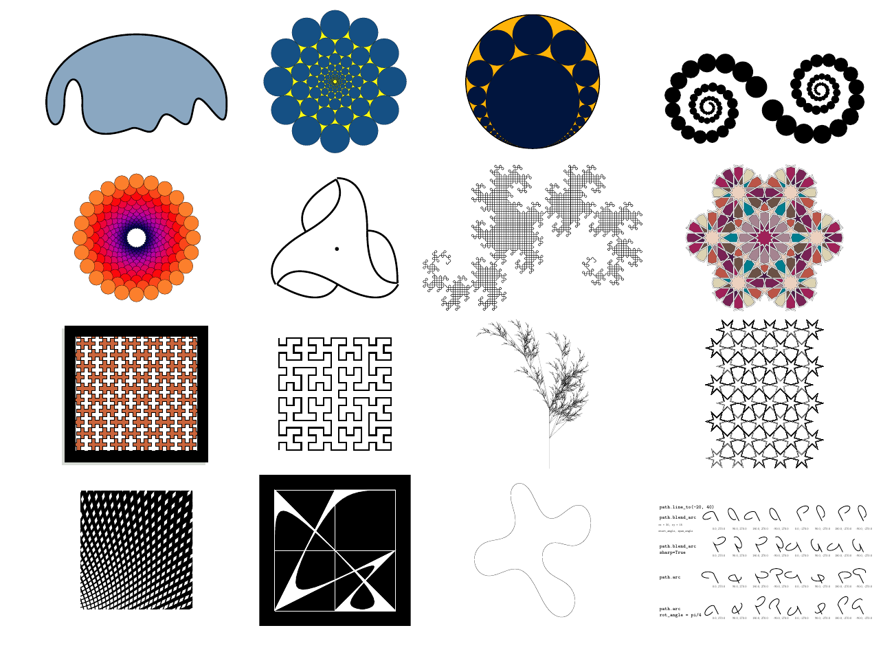

# SİMETRİ Home

##

simetri.graphics (SİMETRİ) is a Python based graphics library that focuses on 2D symmetry operations and pattern generation. It uses the [TikZ library](https://tikz.net) and generates .tex files that can be compiled to create output files. It can also be used in Jupyter notebooks to create complex geometric patterns and designs. The library is designed to be easy to use and flexible, allowing users to create a wide variety of symmetrical patterns with minimal effort. The library also includes a number of computational geometry utility functions for working with 2D geometry.

It is designed to be used in conjunction with XeLaTeX rendering engine. Currently the project is in its late alpha stages and is not ready for production use. Beta release is expected to be in May 2025. Although this version is a proof of concept and is likely to change significantly in the future, it is already capable of producing some interesting results.

SİMETRİ can generate output files with .tex, .pdf, .ps, .eps, .svg, or .png extensions. It can also generate Jupyter notebook cells with the output embedded in them.

* To install simetri.graphics use: `python3 -m pip install --upgrade simetri`
  or  `python -m pip install --upgrade simetri` 
  [More information about installation.](installation.md)

* To clone the development branch visit [our GitHub page](https://github.com/mekanimo/simetri).

<!-- {width="63.25%" height="63.25%"} -->

<!-- Note: First row from the bottom, second image from left is from  Jannis Maroscheck's Shape Grammars. -->
