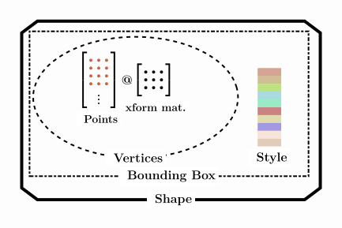

# Markdown Cheat Sheet


## Reference links

### In the same page

Place `<a id="sec_colored_headings"></a>` in the text to create a link to this section, and use `[Colored Headings](#sec_colored_headings)` to link to this section.

The [Colored Headings](#sec_colored_headings) section explains ...

### In another page

Place `<a id="sec_colored_headings"></a>` in colors.md to create a link.
Use `[named-colors](topics/colors.md#sec_color_chart)` to link to the named colors section in the colors page.

When creating RGB or HSV images, you can also use `sg.Color` objects or [named-colors](./topics/colors.md#sec_color_chart).  If the color is None, the image is not initialized.

### A URL
Use:

```
See [the documentation](https://pymupdf.readthedocs.io/en/latest/) for info.
```

For PDF images, SİMETRİ uses the `PyMuPDf` library. You can see [their documentation](https://pymupdf.readthedocs.io/en/latest/) for further info.

## Code Blocks

```py title="Transformed Canvas" linenums="1"
import simetri.graphics as sg

canvas = sg.Canvas()
canvas.help_lines()

canvas.display()
```

## Abbreviations
```
The HTML specification
is maintained by the W3C.

*[HTML]: Hyper Text Markup Language
*[W3C]:  World Wide Web Consortium

will be rendered as:

<p>The <abbr title="Hyper Text Markup Language">HTML</abbr> specification
is maintained by the <abbr title="World Wide Web Consortium">W3C</abbr>.</p>
```

The HTML specification
is maintained by the W3C.

*[HTML]: Hyper Text Markup Language
*[W3C]:  World Wide Web Consortium

## Images


### Captions
```
{ width="300" align="left"}
/// caption
Structure of `Shape` objects.
///
```

{ width="300" align="left"}
/// caption
Structure of `Shape` objects.
///

### Ending alignment

```
{ width="300" align="left"}
This text is to the right of the image.
<BR CLEAR="left">

This should be below the image.
```

{ width="300" align="left"}
This text is to the right of the image.
<BR CLEAR="left">

This should be below the image.

### Captions

Use:

```
{ width="300"}
/// caption
Structure of `Shape` objects.
///
```

{ width="300"}
/// caption
Structure of `Shape` objects.
///


## Math fonts

```
<span style="font-family: 'Cambria Math', sans-serif;">n = (1 + 1)∙(3 + 1)∙(4 + 1)∙3 = 120</span>
```

<span style="italic, font-family: 'Cambria Math', sans-serif;">n = (1 + 1)∙(3 + 1)∙(4 + 1)∙3 = 120</span>

<span style="italic;"> n = (1 + 1)∙(3 + 1)∙(4 + 1)∙3 = 120</span>

*n*

$n = (1 + 1)(3 + 1)(4 + 1)3 = 120$
## Inline Code
```

`#!python PIL.Image.new(mode: str, size: tuple[int, int]) → Image[source]`

```
`#!python PIL.Image.new(mode: str, size: tuple[int, int] | list[int], color: float | tuple[float, ...] | str | None = 0) → Image[source]`

## Definition lists
```
Apple
:   Pomaceous fruit of plants of the genus Malus in
    the family Rosaceae.

Orange
:   The fruit of an evergreen tree of the genus Citrus.

Will be rendered as:

<dl>
<dt>Apple</dt>
<dd>Pomaceous fruit of plants of the genus Malus in
the family Rosaceae.</dd>

<dt>Orange</dt>
<dd>The fruit of an evergreen tree of the genus Citrus.</dd>
</dl>
```

Apple
:   Pomaceous fruit of plants of the genus Malus in
    the family Rosaceae.

Orange
:   The fruit of an evergreen tree of the genus Citrus.

## Admonitions

[Documentation](https://squidfunk.github.io/mkdocs-material/reference/admonitions/)

### Collapsible Admonitions

??? warning "PIL uses a flipped y-axis and the origin is located at the upper-left corner!"
    The origin of PIL Image objects is located at the upper right corner. <br> To align with the rest of the SİMETRİ library, the origin of sg.Image objects is positioned at the lower left corner, with the positive y direction pointing upwards.

Supported types
Following is a list of type qualifiers provided by Material for MkDocs, whereas the default type, and thus fallback for unknown type qualifiers, is note:

Previously, some of the supported types defined more than one qualifier. For example, authors could use summary or tldr as alternative qualifiers to render an abstract admonition. As this increased the size of the CSS that is shipped with Material for MkDocs, the additional type qualifiers are now all deprecated and will be removed in the next major version. This will also be mentioned in the upgrade guide.

!!! note
  Lorem ipsum dolor sit amet, consectetur adipiscing elit. Nulla et
  euismod nulla. Curabitur feugiat, tortor non consequat finibus, justo
  purus auctor massa, nec semper lorem quam in massa.
!!! abstract
  Lorem ipsum dolor sit amet, consectetur adipiscing elit. Nulla et
  euismod nulla. Curabitur feugiat, tortor non consequat finibus, justo
  purus auctor massa, nec semper lorem quam in massa.
!!! info
  Lorem ipsum dolor sit amet, consectetur adipiscing elit. Nulla et
  euismod nulla. Curabitur feugiat, tortor non consequat finibus, justo
  purus auctor massa, nec semper lorem quam in massa.
!!! tip
  Lorem ipsum dolor sit amet, consectetur adipiscing elit. Nulla et
  euismod nulla. Curabitur feugiat, tortor non consequat finibus, justo
  purus auctor massa, nec semper lorem quam in massa.
!!! success
  Lorem ipsum dolor sit amet, consectetur adipiscing elit. Nulla et
  euismod nulla. Curabitur feugiat, tortor non consequat finibus, justo
  purus auctor massa, nec semper lorem quam in massa.
!!! question
  Lorem ipsum dolor sit amet, consectetur adipiscing elit. Nulla et
  euismod nulla. Curabitur feugiat, tortor non consequat finibus, justo
  purus auctor massa, nec semper lorem quam in massa.
!!! warning
  Lorem ipsum dolor sit amet, consectetur adipiscing elit. Nulla et
  euismod nulla. Curabitur feugiat, tortor non consequat finibus, justo
  purus auctor massa, nec semper lorem quam in massa.
!!! failure
  Lorem ipsum dolor sit amet, consectetur adipiscing elit. Nulla et
  euismod nulla. Curabitur feugiat, tortor non consequat finibus, justo
  purus auctor massa, nec semper lorem quam in massa.
!!! danger
  Lorem ipsum dolor sit amet, consectetur adipiscing elit. Nulla et
  euismod nulla. Curabitur feugiat, tortor non consequat finibus, justo
  purus auctor massa, nec semper lorem quam in massa.
!!! bug
  Lorem ipsum dolor sit amet, consectetur adipiscing elit. Nulla et
  euismod nulla. Curabitur feugiat, tortor non consequat finibus, justo
  purus auctor massa, nec semper lorem quam in massa.
!!! example
  Lorem ipsum dolor sit amet, consectetur adipiscing elit. Nulla et
  euismod nulla. Curabitur feugiat, tortor non consequat finibus, justo
  purus auctor massa, nec semper lorem quam in massa.
!!! quote
  Lorem ipsum dolor sit amet, consectetur adipiscing elit. Nulla et
  euismod nulla. Curabitur feugiat, tortor non consequat finibus, justo
  purus auctor massa, nec semper lorem quam in massa.


<a id="sec_colored_headings"></a>
## Colored Headings
## Supported image formats


