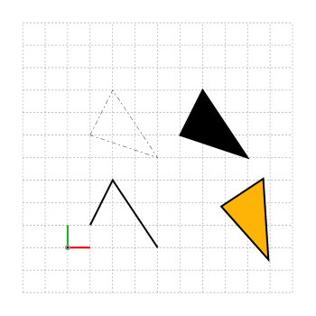

<div id="random-image-container3"></div>
<!-- more -->
# Tutorial: A simple triangle shape

# Interface

* Click on the plus signs (:material-plus-circle:) to see the   comments about the corresponding line of code.
* You can also click on the copy icon located at the upper right   corner to copy the code to your clipboard.
* Clicking on the images will open them.
* Graphic output of the scripts are shown next to or below   the code snippets.
* Some examples may have more then one script in the same block.   These are presented in a tabbed format. You can click on the   tabs to see the other scripts.

<!-- <div style="display: grid; grid-template-columns: 60% 40%; gap: 10px; align-items: center;">
    <div style="height: 100%; overflow: auto; border: 1px solid #ccc;">
        <pre style="height: 100%; margin: 0;"> -->
<!-- <div class="grid"  markdown> -->
```py title="Triangle" linenums="1"
import simetri.graphics as sg # (1)!

canvas = sg.Canvas() # (2)!
canvas.help_lines(pos=(-50, -50), width=300, height=300, spacing=25)

points = [(25, 25), (50, 75), (100, 0)] # (3)!
triangle = sg.Shape(points) # (4)!
canvas.draw(triangle, line_width=2) # (5)!

triangle2 = sg.Shape([(25, 125), (50, 175), (100, 100)], closed=True)
canvas.draw(triangle2, fill=False, line_dash_array=[5, 3, 2, 3])
triangle2.translate(dx=100, dy=0)
canvas.draw(triangle2, line_width=2)

triangle2.fill_color = sg.amber
triangle2.rotate(-sg.pi/4) # (6)!
canvas.draw(triangle2, line_width=2)
canvas.display() # (7)!
```

1. !!! warning annotate "Always import the library like this!"
       And never use `#!python
       from simetri import *
    `  <br>since it may create a lot of problems! Your namespace
       will be polluted
       and debugging will be very difficult.
2. !!! tip annotate ""
       * We do not need to specify `size` for the canvas. It will be automatically computed if it is not used.<br>
       * `canvas = sg.Canvas(back_color=sg.yellow)` can be used to set the background color.<br>
       * `canvas` is the conventional variable name for the `Canvas` instances but you can use any valid variable name.
3. !!! tip annotate "Points"
       * Points can be any sequence of (x, y) or (x, y, 1) values. <br>
           [(10, 20), (30, 40), ...], ([15.5, 20., 1], [35, 40, 1], ...) are all valid.
       * `simetri` internally converts them to floating point `numpy`arrays.
       * The units for cooordinates is `pnts`. <br>`72pnts = 1in`<br>
       * Point sizes should be reasonable. If a shape is too large to fit into a page or
           too small to see clearly, we may have numerical problems.
4. !!! tip annotate ""
       By default `#!python shape.closed = False` unless the start and end points are equivalent. <br> `sg.Shape(points, closed=True)` can be used to create a closed shape.
5. !!! tip annotate ""
       The default value for `#!python shape.line_width = 1` but `#!python canvas.draw()` can overwrite any style attributes.
6. !!! tip annotate ""
       All angles in SİMETRİ is counterclockwise positive and in radians. To convert between radians and angles, you can use `sg.radians(angle)` and `sg.degrees(angle)` utility functions to convert an angle from degrees to radians and from radians to degrees respectively.
7. !!! tip annotate ""
       You can use `canvas.save("/your/path/here.pdf")` or in Windows `canvas.save("c:/your/path/here.svg")` to generate an output file. The supported formats are: `.tex`, `.pdf`, `.svg`, `.ps`, `.eps`, and `.png`. You can also use the `show` flag to show the output in a web-browser (the default value for `show` is `True`). Only `.pdf`, `.svg`, and `.png` files can be shown) You can use the `overwrite` flag to overwrite any existing files. <br> `canvas.save("/your/path/here.pdf", show=False, overwrite=True`)

{ width="450px"}
<!-- </div> -->
<!-- </pre>
    </div>
    <div style="display: flex; align-items: center; justify-content: center;">
        
    </div>
</div> -->
