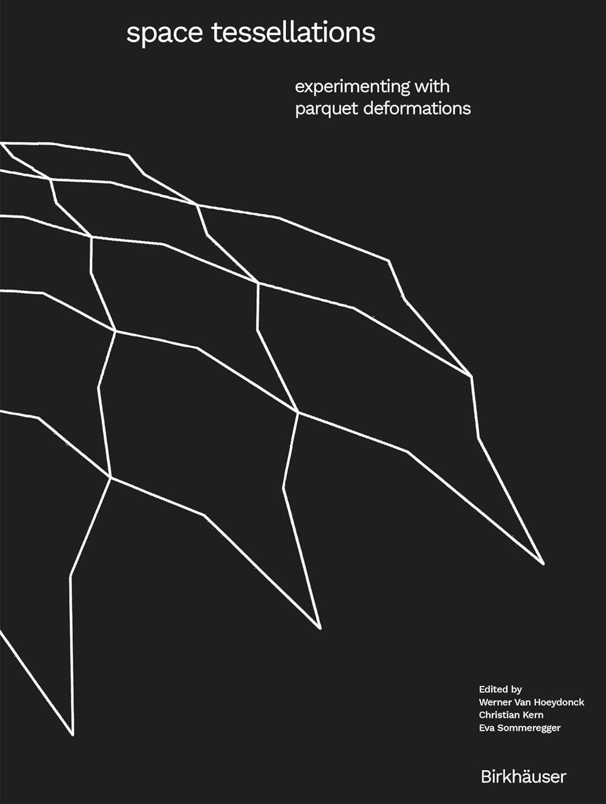

---
date:
   created: 2025-01-08
categories:
    - Books
tags:
    - Parquet Deformations
    - Illustrations
    - Symmetry
readtime: 5
---

# Space Tessellations: Experimenting with Parquet Deformations by Werner van Hoeydonck (Editor), Christian Kern (Editor), Eva Sommeregger (Editor)

{width="200"}

<!-- more -->

## Table of Contents

7.  In Memoriam: William S. Huff (1927–2021)
    From HfG Ulm to Louis Kahn’s Design Office
    From Symmetry to Parquet Deformations with Temporality and Flow Dénes Nagy

8. Introduction
    Werner Van Hoeydonck, Eva Sommeregger

### Research Perspectives

23. Parquet Deformations: A Subtle, Intricate Art Form - Douglas R. Hofstadter

39. Past and Future of William Huff’s Parquet Deformations - Werner Van Hoeydonck

65. Grundlehre at the HfG — A Focus on “Visuelle Grammatik” - William S. Huff

91. Geometry of Structures and Its Philosophical Aesthetic Background - Cornelie Leopold

109. The Tiles, They Are a-Changin’ - Craig S. Kaplan

127. Parametric Modeling of Parquet Deformations: A Novel Method for Design and Analysis - Tuğrul Yazar

143. Pattern Manipulation through Hinged Tessellations - Jay Bonner

163. Parakeet3D: Algorithmic Re-Envisioning of Geometrical Pattern Morphogenesis - Esmaeil Mottaghi, Arman Khalil Beigi Khameneh

### Teaching Perspectives

175. Presenting the Experiments’ Outcomes - Editor’s Note

177. The Tiling and the Whole - Christian Kern

3D Parquet Deformation

183. Exercise 1: 2D Parquets, 2D Parquet Deformation

196. Exercise 2: Continuous Deformation

206. Exercise 3: Deformation of the Basic Structure

214. Exercise 4: 3D Parquets, 3D Parquet Deformation

215. Exercise 5: Design Concept

222. Exercise 6: Presentation Model

### Cellular Space Sequences

253. Exercise 1: Figure Ground

254. Exercise 2: Solid and Void

262. Exercise 3: Composition and Design

268. Exercise 4: Presentation Model

### Additional Sections

301. Epilogue

302. Acknowledgments

303. Imprint