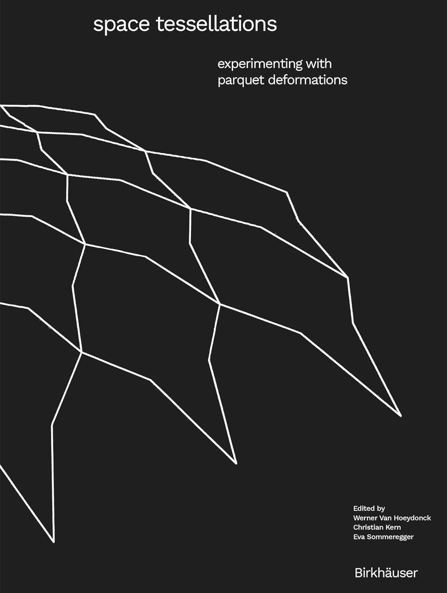

# Reading

These are the books that I used and liked. There will be brief summaries of each book. Books are grouped by their tags. Each book may have one or more tags. You can view a list of categorized books in [the tags page](tags.md).

[{width="125"}](books/tilings_and_patterns.md)
[{width="125"}](books/the_symmetries_of_things.md)
[{width="125"}](books/visions.md)
[{width="125"}](books/the_fascination_of_groups.md)
[{width="125"}](books/anadolu_selcuklu_sanati.md)
[{width="125"}](books/handbook_of_reg_patterns.md)
[{width="125"}](books/paccard_morocco.md)
[{width="125"}](books/how_to_draw_alhambra.md)
[{width="125"}](books/topkapi_scroll.md)
[{width="125"}](books/space_tessellations.md)
[{width="125"}](books/intro_graph_theory.md)
[{width="125"}](books/demiriz.md)
[{width="125"}](books/casselman.md)
[{width="125"}](books/beyer.md)
[{width="125"}](books/humbert.md)
[{width="125"}](books/bonner.md)
