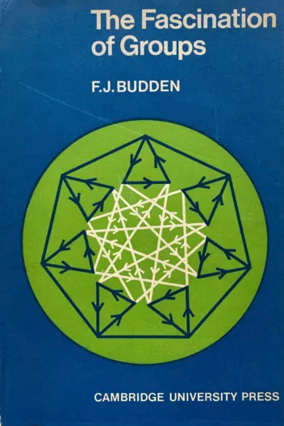
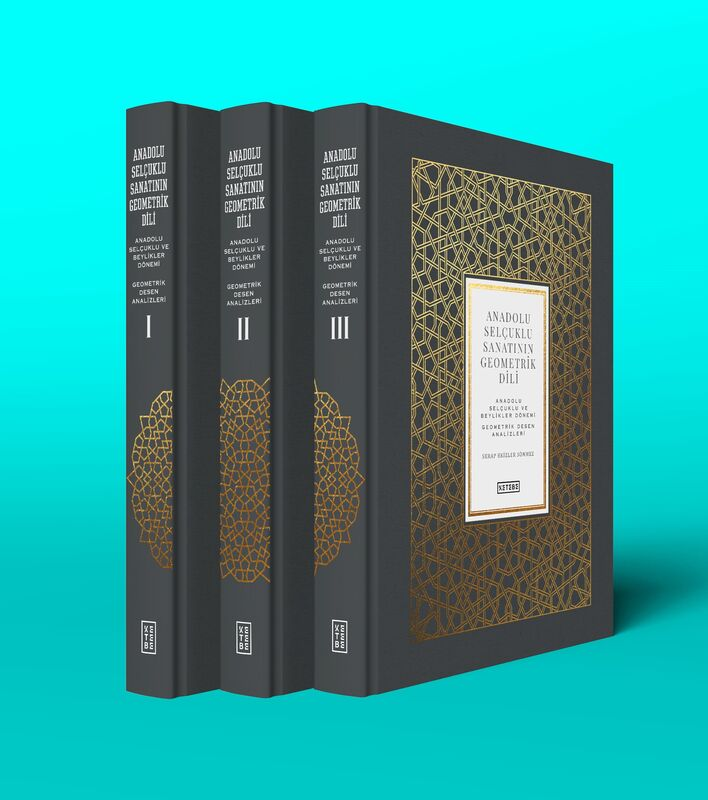

# Reading

<!-- {width="200"} -->

* [Tilings and Patterns](posts/tilings_and_patterns.md) Second Edition (Dover Books on Mathematics) 2nd Edition by Branko Grünbaum & G.C. Shepard

{width="200"}

* [The Symmetries of Things](posts/the_symmetries_of_things.md) by John H. Conway, Heidi Burgiel, and Chaim Goodman-Strauss

{width="200"}

* [The Fascination of Groups](posts/the_fascination_of_groups.md) by F.J. Budden

{width="200"}

* [Handbook of regular patterns](posts/handbook_of_reg_patterns.md) by G. C. Shephard

{width="200"}

* [Anadolu Selçuklu Sanatının Geometrik Dili by Serap Ekizler Sönmez](posts/anadolu_selcuklu_sanati.md)

{width="200"}

* [How to draw the mosaics of the Alhambra by Manuel Martínez Vela](posts/how_to_draw_alhambra.md)

{width="200"}

* [Space Tessellations: Experimenting with Parquet Deformations by Werner van Hoeydonck (Editor), Christian Kern (Editor), Eva Sommeregger (Editor)](posts/space_tessellations.md)

{width="200"}

* [Topkapi Scroll: Geometry and Ornament in Islamic Architecture by Gülru Necipoğlu](posts/topkapi_scroll.md)

{width="200"}