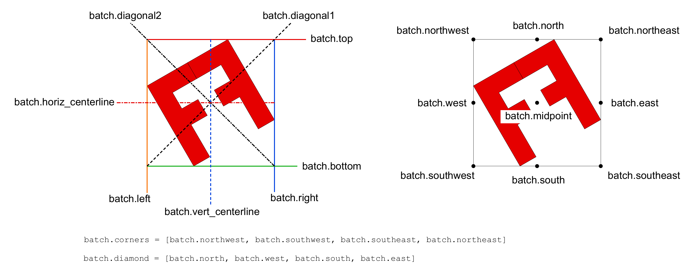

<div id="random-image-container2"></div>
# Batch Objects

`Batch` objects along with the `Shape` objects are the main building blocks of SİMETRİ. They are used to group multiple shapes, paths, and other `Batch` objects together, allowing for complex designs to be created easily. A `Batch` object can contain other `Batch` objects, enabling a hierarchical structure for organizing shapes and patterns.

As the name suggests, `Batch` objects can be used to modify its elements all at once. For example, you can change the color of all shapes in a `Batch` object with a single command. For example; `#!python batch.set_attribs('fill_color', sg.red)` will change the fill color of all shapes in the `Batch` object to red.

`Batch` objects have no style properties. They are used to group shapes and other `Batch` objects together. The `Batch` object itself does not have any visual identity itself, but it can be used to apply transformations and styles to the shapes it contains.

`Batch` objects have bounding-boxes, which are used to define the area that the `Batch` object occupies. The bounding-box of a `Batch` object is the smallest rectangle that can enclose all the shapes and other `Batch` objects it contains. The bounding-box can be used as reference points/lines to apply transformations to the `Batch` object as a whole.

`Batch` objects behave like Python lists and sets. See the [List Operations](#list-operations) and [Set Operations](#set-operations) sections for more details. These operations make `Batch` objects very flexible and powerful for creating complex designs while keeping the data structure simple and easy to use. Most objects in SİMETRİ and its extensions inherit from `Shape` and `Batch` classes.


{ width="600" align="left"}
/// caption
The Structure of `Batch` objects.
///

!!! note "Batch objects can contain other Batch objects."

## Creating a Batch Object

`Batch` objects can be created using the `Batch` class. They can be initialized with no arguments, with a single item, or a list of items. The items can be any object, including other `Batch` objects. The following example shows how to create a `Batch` object with a variety of items:

```python

import simetri.graphics as sg

shape1 = sg.Shape()
shape2 = sg.Shape()
shape3 = sg.Shape()

batch1 = sg.Batch()
batch2 = sg.Batch(shape1)
batch3 = sg.Batch([batch2, shape2, shape3])
```

### Implicitly Creating a Batch Object

When we transform a `Shape` object with repetitions, a `Batch` object is implicitly created. For example, when we use the `Shape.rotate` method with repetitions, a `Batch` object is created to hold the rotated shapes. The following example shows how this works:

```python
>>> import simetri.graphics as sg
>>> shape = sg.Shape([(0, 0), (100, 100)])
>>> shapes = shape.rotate(sg.pi/6, reps=5)
>>> shapes.type
<Types.BATCH: 'BATCH'>
>>> len(shapes)
6
>>>
```

When we transform a `Batch` object with multiple repetitions, this operation does not yield a new `Batch` object. Instead, the original `Batch` object is modified in place (the transformed objects are appended to the `Batch`). The following example shows how this works:

```python
>>> import simetri.graphics as sg
>>> shape = sg.Shape([(0, 0), (100, 100)])
>>> batch = sg.Batch(shape)
>>> batch.translate(100, 0, reps=3)
Batch(Shape(((0.0, 0.0), (100.0, 100.0)))...Shape(((300.0, 0.0), (400.0, 100.0))))
>>> len(batch)
4
>>>
```
!!! tip "Transformations with zero repetitions modify the original `Shape`/`Batch` object without generating new items."

This allow us to apply consecutive transformations via method chaining to the same `Batch` object without having to handle the intermediate results. For example, we can rotate and translate a `Batch` object in a single command:

```python
>>> import simetri.graphics as sg
>>> shape = sg.Shape([(0, 0), (100, 100)])
>>> batch = sg.Batch(shape)
>>> batch.rotate(sg.pi/6, reps=5).translate(100, 0, reps=3)
Batch(Shape(((0.0, 0.0), (100.0, 100.0)))...Shape(((300.0, 0.0), (163.3974596215561, -36.60254037844381))))
>>> len(batch)
24
>>>
```

!!! note "In SİMETRİ, some operations (transformations, canvas.draw, etc.) can be chained together."

## Batch Object Properties

`Batch` objects have the following properties:

id
:  The id of the `Batch` object. This is a unique identifier (positive integer) for the `Batch` object, created during its construction.

active
:  The active state of the `Batch` object. This is a boolean value that indicates whether the `Batch` object is active or not. If the `Batch` object is active and visible, it will be displayed on the canvas when drawn.
    !!! tip "When a `Batch` object is not active, it cannot be transformed."

visible
: The visibility state of the `Batch` object. This is a boolean value that indicates whether the `Batch` object is visible or not. If the `Batch` object is not visible, it will not be displayed on the canvas when drawn.

all_elements
:   Return a list of all elements in the batch, including the elements in the nested batches.

all_shapes
:   Return a list of all shapes in the batch, including the shapes in the nested batches.

all_vertices
:   Return a list of aggregated list of all vertices from all `Shape` objects in the batch, including the shapes in the nested batches.

all_segments
:   Return a list of all segments in the batch, including the segments in the nested batches.

ids
:  Return a list of all unique ids of the items in the batch. If the element does not have an `id` attribute then `id(item)` will be used.

all_ids
:  Return a list of all unique ids of the items in the batch, including the items in the nested batches. If the element does not have an `id` attribute then `id(item)` will be used. This is similar to `ids` but it returns a list of all ids, including duplicates.

## List Operations

`Batch` objects are similar to Python lists. They can be used as lists and have similar methods. The main difference is that `Batch` objects can only contain unique items. If you try to add an item that already exists in the `Batch`, it will raise a warning message. The following methods are available for `Batch` objects:


append(item)
:   Add an item to the end of the items. It will fail (will trigger a warning message, it doesn't raise an error) if this would cause redundant items in the Batch object. The item can be any object.

clear()
:   Remove all items from the `Batch`.

copy()
:   Return a copy of the `Batch` object. **Not just the items but the whole `Batch` object will be copied.**

count(item)
:   Since all items are unique, count will return either 1 or 0. It doesn't check for equivalence of the items, it checks for identical objects. It will return 1 if there is an item with the same `id`.

extend(<items>)
:   Add items from another sequence of items to the end of the items. It will raise a warning if this would cause redundant items in the `Batch` object. Identical items will be ignored.

index(item, start=0, end=None)
:   Return the index of the first occurrence of a specified item. It will raise a `ValueError` if the item is not found. The `start` and `end` arguments are optional and can be used to specify a range in which to search for the item.

insert(index, item)
:   Insert an item at a specified position. It will fail if this would cause redundant items in the `Batch` object.

pop(ind=-1)
:   Remove and return the item at the specified position (or the last item if no index is specified).

remove(item)
:   Remove the first occurrence of a specified item. It will raise a `ValueError` if the item is not found.

reverse()
:   Reverse the order of the items.

sort(key, reverse=False)
:   Sort the items in ascending order (by default) or in descending order by setting the `reverse` argument to be True. `key` is a function that takes an (item) as an argument and returns a value that will be used for sorting. Unlike Python's sort method the key argument is not optional.

### Indexing and Slicing

`Batch` objects support indexing and slicing. You can access individual items or a range of items using Python's indexing and slicing syntax:

```python
>>> import simetri.graphics as sg
>>> batch = sg.Batch()
>>> batch.append(sg.Shape([(0, 0), (100, 100)]))
>>> batch.append(sg.Shape([(100, 100), (200, 200)]))
>>> batch.append(sg.Shape([(200, 200), (300, 300)]))
>>> batch[0] # Access the first item
Shape(((0.0, 0.0), (100.0, 100.0)))
>>> batch[1:] # Access the second and third item
Shape(((100.0, 100.0), (200.0, 200.0))), Shape(((200.0, 200.0), (300.0, 300.0)))
>>>
```

## Set Operations
`Batch` objects can be used as sets (`batch.ids` is used for hashing).
Items are compared using their `id` attributes. If the item does not have an `id` attribute then `id(item)` will be used. This means that two items with the same content but different ids will be considered as distinct items.

The following methods are available for `Batch` objects:

union(other: Batch)
:   Return a new `Batch` object that contains all the items from both `Batch` objects. If there are any duplicate items, they will be removed.

intersection(other: Batch)
:   Return a new `Batch` object that contains the items that are present in both `Batch` objects.

difference(other: Batch)
:   Return a new `Batch` object that contains the items that are present in the first `Batch` object but not in the second `Batch` object.

symmetric_difference(other: Batch)
:   Return a new `Batch` object that contains the items that are present in either `Batch` object but not in both.

issubset(other: Batch)
:   Return True if the first `Batch` object is a subset of the second `Batch` object, otherwise return False.

issuperset(other: Batch)
:   Return True if the first `Batch` object is a superset of the second `Batch` object, otherwise return False.

isdisjoint(other: Batch)
:   Return True if the two `Batch` objects have no items in common, otherwise return False.

## Batch Objects' Additional Methods

In addition to the methods mentioned above, `Batch` objects have the following additional methods:

merge_shapes() -> Batch
:   Merge all shapes in the batch into a single shape where possible. This is useful for creating complex shapes from simpler ones. This does not modify the batch object or the shapes in it. It returns a new `Batch` object that contains the merged shapes.

set_attribs(attrib: str, value: Any, key: callable=None) -> Self
:  Set the specified attribute for all applicable items in the batch. The attribute can be any attribute of the items in the batch, if an item doesn't have the given attribute then it will be ignored. This is useful for applying a common attribute to all items in the batch.

    If the optional `key` argument is provided, it should be a callable that takes an item as an argument and returns a boolean value. The attribute will only be set for items that return True when passed to the `key` function.

    For example, if you want to set the fill color of all shapes in the batch with more than 4 vertices, you can use the following code:
    ```python
    batch.set_attribs('fill_color', sg.red, key=lambda item: len(item) > 4)
    ```
    This will set the fill color of all shapes in the batch with more than 4 vertices to red.


## Batches as Iterators

`Batch` objects can be used as iterators. This means that you can use them in a for loop or any other context that requires an iterable object. The following example shows how to use a `Batch` object as an iterator:

```python
>>> import simetri.graphics as sg
>>> batch = sg.Batch()
>>> batch.append(sg.Shape([(0, 0), (100, 100)]))
>>> batch.append(sg.Shape([(100, 100), (200, 200)]))
>>> batch.append(sg.Shape([(200, 200), (300, 300)]))
>>> for item in batch:
...     print(item)
...
...Shape(((0.0, 0.0), (100.0, 100.0)))
...Shape(((100.0, 100.0), (200.0, 200.0)))
...Shape(((200.0, 200.0), (300.0, 300.0)))
>>> for item in batch:
...     item.fill_color = sg.red
...     item.line_color = sg.blue
>>>
```

## Bounding Box of a Batch Object

`Batch` objects have bounding-boxes, which are used to define the area that the `Batch` object occupies. The bounding-box of a `Batch` object is the smallest rectangle that can enclose all the shapes and other `Batch` objects it contains. The bounding-box can be used as reference points/lines to apply transformations to the `Batch` object as a whole. For more information about bounding-boxes, see the [Bounding Box](bounding_boxes.md#sec_bounding_boxes) section.

{ width="700"}

!!! note "`width`, `height`, and `size` are not aliases."
    Since some objects have these properties, we cannot use the same names as aliases. To access these properties, we need to use the `b_box` property.

    ```py
        batch.b_box.width
        batch.b_box.height
        batch.b_box.size
    ```
