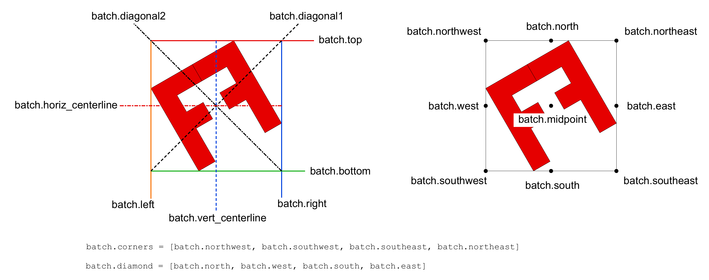
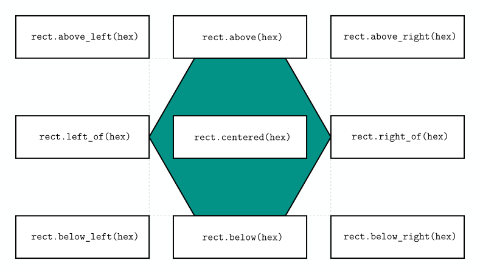
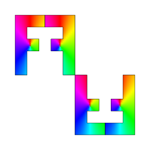

<div id="random-image-container2"></div>
# Bounding-Boxes

## Working With Bounding-Boxes

Bounding-boxes are rectangles that enclose a shape or batch object. They provide reference points and lines that can be used for applying transformations (mirror lines, glide lines, centers of rotations, etc). They provide methods to define offset points and lines as well.

{ width="800"}
/// caption
Properties and methods of `BoundingBox objects`.
///

### Aliases

The bounding-box of a shape or batch object can be accessed through the `b_box` property. The bounding-box is an instance of the `BoundingBox` class, which provides methods and properties for working with bounding-boxes.

SİMETRİ provides a few aliases for Shape and Batch objects to access the bounding-box properties and methods. The following aliases are available:

`item.midpoint -> item.b_box.midpoint`:
:  Middle point of the bounding-box.

`item.north -> item.b_box.north`:
:  Middle point of the top edge of the bounding-box.

`item.south -> item.b_box.south`:
:  Middle point of the bottom edge of the bounding-box.

`item.east -> item.b_box.east`:
:  Middle point of the right edge of the bounding-box.

`item.west -> item.b_box.west`:
:  Middle point of the left edge of the bounding-box.

`item.northwest -> item.b_box.northwest`:
:  Top left corner of the bounding-box.

`item.northeast -> item.b_box.northeast`:
:  Top right corner of the bounding-box.

`item.southwest -> item.b_box.southwest`:
:  Bottom left corner of the bounding-box.

`item.southeast -> item.b_box.southeast`:
:  Bottom right corner of the bounding-box.

`item.top -> item.b_box.top`:
:  Top edge of the bounding-box.

`item.bottom -> item.b_box.bottom`:
:  Bottom edge of the bounding-box.

`item.left -> item.b_box.left`:
:  Left edge of the bounding-box.

`item.right -> item.b_box.right`:
:  Right edge of the bounding-box.

`item.bbox_width -> item.b_box.width`:
:  Width of the bounding-box.

`item.bbox_height -> item.b_box.height`:
:  Height of the bounding-box.

`item.bbox_size -> item.b_box.size`:
:  `#!python (width, height)` Size of the bounding-box.

{ width="800"}

!!! note "`width`, `height`, and `size` are not aliases."
    Since some objects have these properties, we cannot use the same names as aliases. To access these properties, we need to use the `b_box` property.

    ```py
        shape.b_box.width
        shape.b_box.height
        shape.b_box.size
    ```

## Relative Positioning

When we need to position two items relative to each other, we can use the bounding-box of one item to position the other. The bounding-box of a shape or batch object is accessible through the `b_box` property.

The following methods are available for positioning items relative to each other:

`#!python item.b_box`:

`#!python item.centered(other: Shape | Batch, dx: float=0, dy: float=0)`
: Position of the item centered on the other item.

`#!python item.above(other: Shape | Batch, dx: float=0, dy: float=0)`
: Position of the item above the other item.

`#!python item.below(other: Shape | Batch, dx: float=0, dy: float=0)`
: Position of the item below the other item.

`#!python item.left_of(other: Shape | Batch, dx: float=0, dy: float=0)`
: Position of the item to the left of the other item.

`#!python item.right_of(other: Shape | Batch, dx: float=0, dy: float=0)`
: Position of the item to the right of the other item.

`#!python item.above_left(other: Shape | Batch, dx: float=0, dy: float=0)`
: Position of the item above and to the left of the other item.

`#!python item.above_right(other: Shape | Batch, dx: float=0, dy: float=0)`
: Position of the item above and to the right of the other item.

`#!python item.below_left(other: Shape | Batch, dx: float=0, dy: float=0)`
: Position of the item below and to the left of the other item.

`#!python item.below_right(other: Shape | Batch, dx: float=0, dy: float=0)`
: Position of the item below and to the right of the other item.

!!! tip "These relative positions can be used with `dx` and `dy` offsets."

The following example shows how to use the bounding-box of a shape to position another shape relative to it.

```python
import simetri.graphics as sg

canvas = sg.Canvas()
canvas.back_color = sg.Color(254, 255, 255)

hex = sg.reg_poly_shape((0, 0), 6, 150)
rect = sg.Rectangle((0, 0), 220, 70)
positions = ['centered', 'right_of', 'left_of', 'below_left', 'below_right',
             'above_right', 'above_left', 'above', 'below']
canvas.draw(hex.b_box)
canvas.draw(hex, fill_color=sg.teal, line_width=2)
for position in positions:
    pos = getattr(rect, position)(hex)
    canvas.draw(rect, pos=pos, fill_color=sg.white, line_width=2)
    canvas.text(f"rect.{position}(hex)", pos, font_family=sg.FontFamily.MONOSPACE,
                font_size=sg.FontSize.LARGE2)

canvas.display()
```
{ width="600"}


```python
import simetri.graphics as sg

canvas = sg.Canvas()

F = sg.letter_F(back_style=sg.BackStyle.SHADING,
                shade_type=sg.ShadeType.COLORWHEEL)

letters = F.mirror(F.right, reps=1)
letters.rotate(angle=sg.pi, about=letters.southeast, reps=1)

canvas.draw(letters)
canvas.display()
```

{ width="200"}
