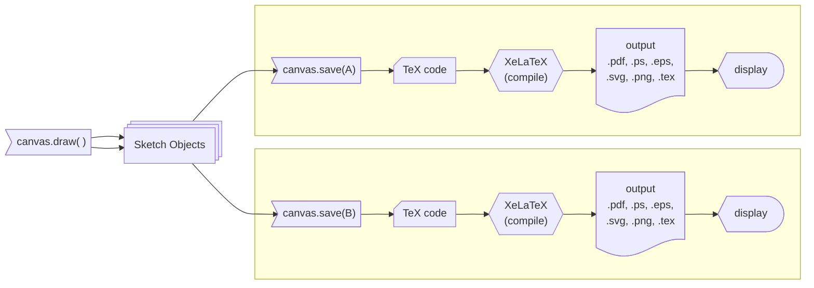

# Canvas

Canvas objects provide a way to draw and manipulate graphics in a 2D space. They are used to create images, shapes, and other visual elements. The canvas can be thought of as a blank sheet of paper where you can draw graphics objects.

## Initialization

Canvas objects are created using the `Canvas` class. They can be initialized with no arguments. When we use the `Canvas.save` method, the canvas object automatically computes the appropriate size by using the dimensions of the drawn objects and the `canvas.border` property (which specifies the page margins).

## Drawing

`Canvas.draw` method is used to draw graphics objects on the canvas. The `draw` method takes a drawable object as an argument and draws it on the canvas.

### Overwriting Object Properties

### Output Format

### Help-lines

## Transformations

Canvas objects can be transformed by using transformation methods. This is similar to the `Shape` and `Batch` objects. The transformations are applied to the canvas itself, which means that all subsequent drawing operations will be affected by the applied transformation.

## Resetting the Canvas

### Resetting the Transformation Matrix

## Clipping

## Multiple-page Output

## Jupyter Notebooks

## Rendering Pipeline

