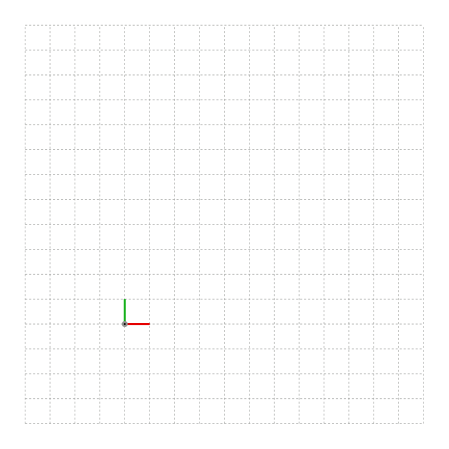
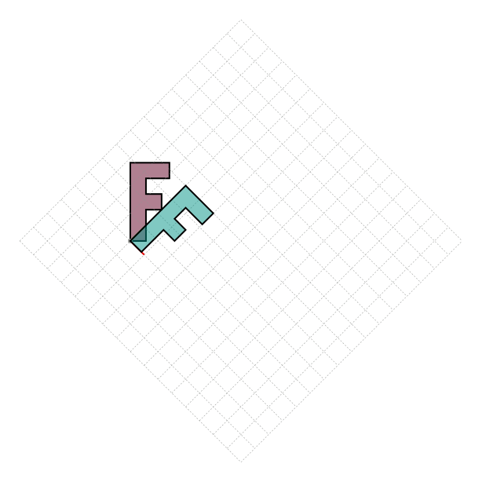
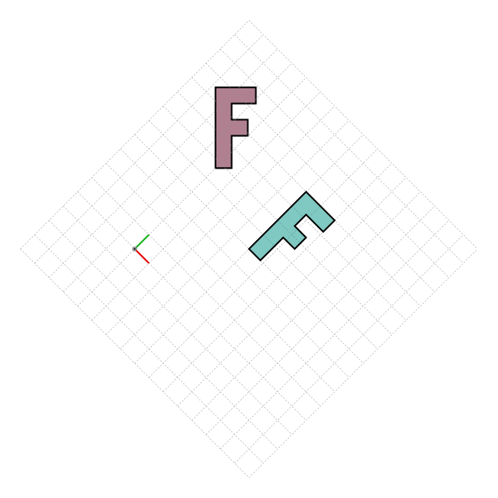

<div id="random-image-container2"></div>
# Conventions

## Coordinates
SİMETRİ uses Cartésian coordinates to define geometry. Origin is located at the lower-left corner with the positive x direction pointing rightward and positive y direction pointing upwards.

All angles are in radians and measured from the positive x-axis in counterclockwise positive direction.

* `sg.radians(degrees) -> float` converts from degrees to radians.
* `sg.degrees(radians) -> float` converts from radians to degrees.
* `sg.angle(point: Point) -> float` returns the angle of the vector from the origin to the point `(x, y)` in radians.
* `sg.line_angle(start: Point, end: Point) -> float` returns the angle of the line from `start` to `end` in radians.

There are utility functions to convert from/to polar-coordinates.

* `sg.polar_to_cartesian(r: float, theta: float) -> Point[float, float]` converts from polar coordinates to Cartésian coordinates.
* `sg.cartesian_to_polar(x: float, y: float) -> Point[float, float]` converts from Cartésian coordinates to polar coordinates.

### Help Lines
`canvas.help_lines()` method can be used to draw a grid with the origin (depicted with a circle), x (colored red), and y-axis (colored green) shown on the canvas. The `help_lines` method has the following signature:

```python
canvas.help_lines(pos: Point=(-100, -100), width: float=600, height: float=600,
                                                            spacing: float=25)
```

{ width="300"}

### Coordinate transformations

`Canvas` object can be translated, rotated, and scaled. The order of transformations can be important. All drawing operations performed following the transformation will be affected by the transformation. Help-lines reflect the coordinate transformations as well.

=== "Rotated `Canvas`"

    ```py title="Transformed Canvas" linenums="1"
    import simetri.graphics as sg

    canvas = sg.Canvas()

    F = sg.letter_F(fill_color=sg.teal, line_width=2, alpha=.5) # (1)!
    canvas.draw(F, fill_color=sg.burgundy)
    canvas.rotate(-sg.pi/4)

    canvas.help_lines() # (2)!
    canvas.draw(F)

    canvas.save('/your/path/translate_rotate.png', overwrite=True)
    ```

    1. !!! tip annotate "`sg.letter_F()`"
       `letter_F()` is a function that returns an F-shaped object. Since this shape has no symmetries, it is a good example to show the effect of transformations.
    2. !!! tip annotate "canvas.help_lines() after canvas.rotate()"
       Since the help_lines are drawn after the rotation, they will be rotated as well.

    { width="300"}


=== "Translated letter_F and Rotated Canvas"

    ```py title="Transformed letter_F and Canvas" linenums="1"
    import simetri.graphics as sg

    canvas = sg.Canvas()

    F = sg.letter_F(fill_color=sg.teal, line_width=2, alpha=.5)
    F.translate(100, 100)

    canvas.draw(F, fill_color=sg.burgundy)
    canvas.rotate(-sg.pi/4)

    canvas.help_lines()
    canvas.draw(F)

    canvas.save('/your/path/rotate.png', overwrite=True)
    ```
    { width="300"}


## Units

For defining geometry (using `Shape` objects), SİMETRİ uses `points` as the unit of measurement. For images, the unit of measurement is `pixels`. The conversion between points and pixels is as follows (assuming a resolution of 96 DPI):

* 1 point = 1 / 72 inch
* 1 pixel = 1 / 96 inch (1 / DPI)
* 1 point = 0.75 pixel (72 / DPI)

All angles are in radians. The conversion between degrees and radians is as follows:

* 1 degree = $\frac{\pi}{180}$ radians
* 1 radian = $\frac{180}{\pi}$ degrees
* 1 radian = 57.2958 degrees

<!-- * Angle units are in radians `[rad]`.<br>
    $2\Pi rad = 360^{\circ}$ -->

### Other units used in $\LaTeX$

| Unit | Explanation                                    |
| :----| :----------------------------------------------|
| pt   | Equal to 1/72.27 inch                          |
| in   | inch                                           |
| mm   | millimeter                                     |
| cm   | centimeter                                     |
| ex   | height of an 'x' character in the current font |
| em   | width of an 'M' character in the current font  |
| mu   | 1/18 em                                        |
| sp   | special point, 65,536sp = 1pt                  |

## Points, vertices, and coordinates

In SİMETRİ, points are represented as sequences of two or three values. The first two values correspond to the x and y coordinates of the point, while the third value, which is always 1, represents the point in homogeneous coordinates. Internally, multiple points are stored as NumPy arrays, specifically as a 2D array with the shape (n, 3), where n is the number of points. For 2D points, the third value remains 1 to ensure representation in homogeneous coordinates.

The term "points" usually refers to the initial (x, y) coordinates, while "vertices" refer to the `shape.vertices` property, which is a tuple of (x, y) tuples. Since tuples are immutable in Python, the vertices cannot be modified directly. However, `Shape` objects can behave like Python lists, allowing for the modification, addition and removal of points. The term "coordinates" can refer to either the initial points or the vertices, depending on the context.

## Matrices

Matrices serve as the backbone of the SİMETRİ library. They are utilized for defining geometry (as 𝑛 × 3 matrices representing 𝑛 points) and performing transformations (as 3 × 3 matrices). The transformation matrix, specifically a 3 × 3 matrix, is used to transform points in homogeneous coordinates. Both geometry definition and transformations follow column-major order to avoid the need for transposing matrices back and forth. Although most modern linear-algebra books use row-major order, as long as we are consistent this difference does not pose any issues. The transformation matrix can be summarized as follows:

$$T = \begin{bmatrix}
\cos \theta & \sin \theta & s_x\\
-\sin \theta & \cos \theta & s_y\\
d_x & d_y & 1
\end{bmatrix}$$


where $\theta$ is the angle of rotation in radians, $s_x$ and $s_y$ are the scaling factors in the x and y directions, respectively, and $d_x$ and $d_y$ are the translation factors in the x and y directions, respectively.

??? warning "How to read composite transformations."
    When we combine multiple transformations, the order of operations matters. For example, if we want to apply a translation followed by a rotation, we need to multiply the translation matrix by the rotation matrix. The order of multiplication is important because matrix multiplication is not commutative. In other words, $T_1 \cdot T_2 \neq T_2 \cdot T_1$.

    If the matrices are in row-major order, the multiplication order is from right to left. This convention is popular because it is consistent with the way functions are applied in mathematics.

    In SİMETRİ, we use column-major order for matrices, which means that the multiplication order is from left to right. This is easier to read for beginners but it may cause problems for people who are used to the row-major order.

Every `Shape` object is initiated with the identity matrix. The identity matrix is a square matrix with ones on the diagonal and zeros elsewhere. It is represented as follows:

$$I = \begin{bmatrix}
1 & 0 & 0\\
0 & 1 & 0\\
0 & 0 & 1
\end{bmatrix}$$


Every transformation is represented as a matrix multiplication. For example, the transformation of a point $P$ is represented as:

$$P' = P \cdot T$$

where $P'$ is the transformed point, $T$ is the transformation matrix, and $P$ is the original point.

When we have n points, the transformation is represented as:

$$P = \begin{bmatrix}
x_1 & y_1 & 1\\
x_2 & y_2 & 1\\
\vdots & \vdots & \vdots\\
x_n & y_n & 1\\
\end{bmatrix}$$


$$P' = P \cdot T$$

$$P' = \begin{bmatrix}
x'_1 & y'_1 & 1\\
x'_2 & y'_2 & 1\\
\vdots & \vdots & \vdots\\
x'_n & y'_n & 1\\
\end{bmatrix}$$

where $P'$ is the transformed points, $T$ is the transformation matrix, and $P$ is the original points.

The key advantage of these matrix representations is their efficiency in computing multiple transformations across multiple points simultaneously. Instead of applying each transformation to individual points one by one, we can first multiply the transformation matrices together and then apply the resulting matrix to all points in a single operation. This approach significantly improves computational speed, especially when dealing with large numbers of points.

!!! Tip "Matrix multiplication is not commutative:  $T_1 \cdot T_2 \neq T_2 \cdot T_1$"


## Chaining methods

Most methods in SİMETRİ return the object itself. This allows for chaining methods together to create more complex transformations. For example, the following code applies successive transformations to a shape:

```python
shape.translate(10, 20).rotate(30).scale(2, 3)
```

Most `Canvas` methods also return the object itself (`Canvas` object), allowing for chaining methods together. For example, the following code applies successive `Canvas` operations in a single line:

```python
canvas.draw(shape).translate(100, 0).draw(shape2).save('output.png')
```


## Arguments with `None` default values

Allmost all methods in SİMETRİ have default values for their arguments. If an argument is not specified, the default value will be used.

<!-- $$
\cos x=\sum_{k=0}^{\infty}\frac{(-1)^k}{(2k)!}x^{2k}
$$ -->