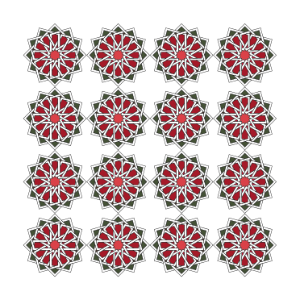

<div id="random-image-container2"></div>

## Working with images

## PIL Image Object

The Image object in SİMETRİ inherits from the PIL (Pillow) library and adds more methods to blend it with the rest of the SİMETRİ library. There are some fundamental differences between the PIL's Image object and SİMETRİ' Image object.

!!! warning "Image objects are still experimental and subject to change!"

In addition to the possibility of inserting images into $\TeX$ code, we can use images to generate output without having to compile a $\TeX$ file. One of the major issues with compiling $\TeX$ files is the memory size limitations that a $\TeX$ compiler (XeLaTeX in SİMETRİ) has. We can generate an image directly (without compiling) by using the `draw` method of the `Canvas.save` method with the `img` argument. Not every option (shadings, grids, line-styles, etc.) is compatible with this method.

For PDF images, SİMETRİ uses the `PyMuPDf` library. You can see [their documentation](https://pymupdf.readthedocs.io/en/latest/) for further info.

You can use the comprehensive documentation at the [Pillow website](https://pillow.readthedocs.io/en/stable/) for more information. SİMETRİ's [API documentation](https://mekanimo.github.io/simetri-docs/simetri.html) doesn't include the whole PIL library, just the Image module.


??? warning "PIL uses a flipped y-axis and the origin is located at the upper-left corner!"
    The origin of PIL Image objects is located at the upper right corner. <br> To align with the rest of the SİMETRİ library, the origin of sg.Image objects is positioned at the lower left corner, with the positive y direction pointing upwards.

Image objects can be initiated by using an existing image file as shown below.

```py
>>> import simetri.graphics as sg
>>> img = sg.Image(img="/your/path/here.png") # (1)!
>>> print(img.info) # (2)!
    {'dpi': (96.012, 96.012)}
>>> img.show() # (3)!
>>> img.size
    (374, 331)
>>> img.format
    'PNG'
>>> img.mode
    'RGB'
>>> img.filename # (4)!
    'your\path\here.png'
>>> thumb_size = (64, 64)
>>> img.thumbnail(thumb_size)
>>> img.save("/your/path/here_tn.png")
>>> img.size
    (64, 57) # (5)!
>>> img2 = sg.Image.open("/your/path/here.png")
>>> img2.crop((left=10, bottom=10, right=320, top=320)) # (6)!
    <PIL.Image.Image image mode=RGB size=310x310 at 0x28FB7F90050>
>>> cropped = img2.crop((10, 10, 320, 320)) # (6)!
>>> cropped.thumbnail(thumb_size)
>>> cropped.size
>>> (64, 64)
>>>
```

1. !!! tip annotate ""
       If the image file resides in the same directory as the script file then the full-path is not necessary, just the filename would be sufficient.
2. !!! tip annotate ""
       The `info` property returns a dictionary with the image's metadata. Some images have no data in the `info` property.
3. !!! tip annotate ""
       This uses the system's preview setting. This could be different for each image format.
4. !!! tip annotate ""
       The `filename` property applies only to images created from an existing image file.
5. !!! tip annotate ""
       Since the original picture was not square, we got a proportionally sized thumbnail."
6. !!! tip annotate ""
       Unlike the `thumbnail` method, `crop` method does not modify the original image, it returns a new image with the given size.
7. !!! tip annotate ""
       Since the coordinate-systems are different, this operation yields a different result than cropping the same image with PIL's Image object. While PIL uses `crop(left, top, right, bottom)`, SİMETRİ uses `crop(left, bottom, right, top)`.

!!! note "Images can be created from scratch or opened from existing files."

## Supported image formats

PIL's Image module can handle numerous different formats in different ways. These formats may not be available in all environments depending on the OS.

* Fully supported formats: AVIF, BLP, BMP, DDS, DIB, EPS, GIF, ICNS, ICO, IM, JPEG, JPEG 2000, MPO, MSP, PCX, PFM, PNG, APNG, SPIDER, TGA, TIFF, WebP, and XBM.
* Read-only formats: CUR, DCX, FITS, FLI, FLC, FPX, FTEX, GBR, GD, IMT, IPTC/NAA, MCIDAS, MIC, PCD, PIXAR, PSD, QOI, SUN, WAL, WMF/EMF, and XPM.
* Write-only formats: PDF, XV Thumbnails.
* Identify-only formats: BUFR, GRIB, HDF5, and MPEG.

## Creating a new image

To create a new image, we can use the `sg.Image(pos, size, mode)` method.

`#!python PIL.Image.new(mode: str, size: tuple[int, int] | list[int], color: float | tuple[float, ...] | str | None = 0) → Image[source]`


Creates a new image with the given mode and size.

Parameters:

* **`mode`** : The mode to use for the new image. See: [Modes](#sec_modes).
* **`size`** : A 2-tuple, containing (width, height) in pixels.
* **`color`** : What color to use for the image. Default is black. If given, this should be a single integer or floating point value for single-band modes, and a tuple for multi-band modes (one value per band). When creating RGB or HSV images, you can also use `sg.Color` objects or [named-colors](colors.md#sec_color_chart).  If the color is None, the image is not initialized.

Returns:
An Image object.

<a id="sec_modes"></a>
## Modes

This section is taken from: <https://pillow.readthedocs.io/en/stable/handbook/concepts.html#concept-modes>


The ``mode`` of an image is a string which defines the type and depth of a pixel in the
image. Each pixel uses the full range of the bit depth. So a 1-bit pixel has a range of
0-1, an 8-bit pixel has a range of 0-255, a 32-signed integer pixel has the range of
INT32 and a 32-bit floating point pixel has the range of FLOAT32. The current release
supports the following standard modes:

    * ``1`` (1-bit pixels, black and white, stored with one pixel per byte)
    * ``L`` (8-bit pixels, grayscale)
    * ``P`` (8-bit pixels, mapped to any other mode using a color palette)
    * ``RGB`` (3x8-bit pixels, true color)
    * ``RGBA`` (4x8-bit pixels, true color with transparency mask)
    * ``CMYK`` (4x8-bit pixels, color separation)
    * ``YCbCr`` (3x8-bit pixels, color video format)

      * Note that this refers to the JPEG, and not the ITU-R BT.2020, standard

    * ``LAB`` (3x8-bit pixels, the L*a*b color space)
    * ``HSV`` (3x8-bit pixels, Hue, Saturation, Value color space)

      * Hue's range of 0-255 is a scaled version of 0 degrees <= Hue < 360 degrees

    * ``I`` (32-bit signed integer pixels)
    * ``F`` (32-bit floating point pixels)

Pillow also provides limited support for a few additional modes, including:

    * ``LA`` (L with alpha)
    * ``PA`` (P with alpha)
    * ``RGBX`` (true color with padding)
    * ``RGBa`` (true color with premultiplied alpha)
    * ``La`` (L with premultiplied alpha)
    * ``I;16`` (16-bit unsigned integer pixels)
    * ``I;16L`` (16-bit little endian unsigned integer pixels)
    * ``I;16B`` (16-bit big endian unsigned integer pixels)
    * ``I;16N`` (16-bit native endian unsigned integer pixels)

Premultiplied alpha is where the values for each other channel have been
multiplied by the alpha. For example, an RGBA pixel of ``(10, 20, 30, 127)``
would convert to an RGBa pixel of ``(5, 10, 15, 127)``. The values of the R,
G and B channels are halved as a result of the half transparency in the alpha
channel.

Apart from these additional modes, Pillow doesn't yet support multichannel
images with a depth of more than 8 bits per channel.

Pillow also doesn’t support user-defined modes; if you need to handle band
combinations that are not listed above, use a sequence of Image objects.

You can read the mode of an image through the `PIL.Image.Image.mode`
attribute. This is a string containing one of the above values.


<a id="sec_image_transformations"></a>
## Transformations

`Image` objects can be transformed like the `Shape` and `Batch` objects. If you are not familiar with transformations in SİMETRİ, please see [transformations](transformations.md). Some examples of transformations applied to `Image` objects are shown below.

```py
import simetri.graphics as sg

canvas = sg.Canvas()
star = sg.stars.Star(n=12, circumradius=150).level(4)
lace = sg.Lace(star, swatch=sg.random_swatch(), offset=5)
canvas.draw(lace.scale(.25))
canvas.border = 0
file_path = '/your/path/star_pic.ps'
canvas.save(file_path, overwrite=True, show=False)
img = sg.Image(file_path)
dx, dy = img.size
images = img.translate(dx, 0, reps=3).translate(0, dy, reps=3)
canvas.reset()
canvas.draw(images)
canvas.save('/your/path/star_pic_translated.svg', overwrite=True)
```
{ width="400"}