<div id="random-image-container2"></div>

# `LinPath` Path Objects

## LinPath

`LinPath` objects are used for creating paths formed by straight and curved lines.

They have `pos` and `angle` properties that define the current position and orientation angle respectively. Their default position is the origin and their default angle is 90 degrees (facing upward).

Their initial position and angle can be specified in the constructor.


```python
import simetri.graphics as sg

pi = sg.pi
path = sg.LinPath()
print(f"path.pos: {path.pos}")
print(f"path.angle: {sg.degrees(path.angle)} degrees\n")

path2 = sg.LinPath((50, 70))
path2.angle = pi/3
print(f"path2.pos: {path.pos}")
print(f"path2.angle: {sg.degrees(path.angle)} degrees")
```

    path.pos: (0, 0)
    path.angle: 90.0 degrees

    path2.pos: (0, 0)
    path2.angle: 90.0 degrees


path.forward(dist)
:   `path.forward` draws a line in the same orientation as the `path.angle` with given length.


```python
import simetri.graphics as sg

canvas = sg.Canvas()

canvas.help_lines(pos=(-50, -50), width=300, height=300, spacing=50)

path = sg.LinPath()
path.angle = pi/4
path.forward(70.71)
path.angle = 0
path.forward(100)
path.angle = pi/2
path.forward(100)

canvas.draw(path, line_width=2)

canvas.display()

```


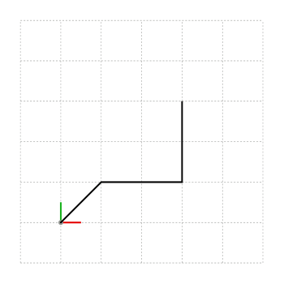


```python
import simetri.graphics as sg

canvas = sg.Canvas()


path = sg.LinPath()
path.angle = sg.pi
d = 120
for i in range(12):
    path.forward(d)
    d -= 10
    path.angle -= sg.pi/2

paths = path.translate(120, 0, reps=4)
canvas.draw(paths, line_width=10, line_color=sg.terra_cotta)
canvas.help_lines(pos=(-150, -50), width=700, height=200, spacing=25)
canvas.display()
```


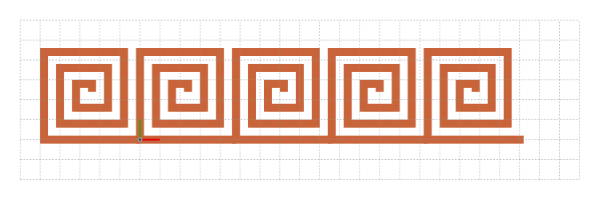{style="border-radius:20px"}


path.line_to(point)
:   Draws a line between the path's current position and the given point. Path object's orientation angle changes to the orientation angle of the specified line, and its position changes to the given point.


```python
import simetri.graphics as sg

canvas = sg.Canvas()

canvas.help_lines(pos=(-50, -50), width=200, height=150, spacing=50)

path = sg.LinPath()
path.line_to((120, 60))
print(f"path.pos: {path.pos}")
print(f"path.angle: {sg.degrees(path.angle):.2f} degrees")

canvas.draw(path, line_width=2)

canvas.display()
```

    path.pos: (120, 60)
    path.angle: 26.57 degrees


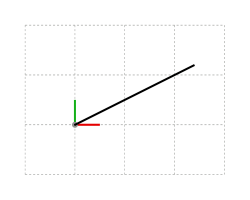


path.h_line(dist)
:   `path.h_line` draws a horizontal line with the given distance. If the `dist` argument is negative then line is drawn in `-x` direction.

path.v_line(dist)
:   `path.v_line` draws a vertical line with the given distance. If the `dist` argument is negative then line is drawn in `-y` direction.

path.close()
:   `path.close()` closes the path.


```python
import simetri.graphics as sg

canvas = sg.Canvas()

canvas.help_lines(pos=(-50, -50), width=300, height=150, spacing=50)

path = sg.LinPath((50, 0))
path.h_line(150)
path.v_line(50)
path.h_line(-100)
path.v_line(-30)
path.close()

canvas.draw(path, line_width=2)

canvas.display()
```


path.arc(radius_x, radius_y, start_angle, span_angle, rot_angle)
:   `path.arc` draws and elliptic arc with the given parameters. Angles are in radians and counterclockwise positive from the positive x-axis.


```python
import simetri.graphics as sg
pi = sg.pi

canvas = sg.Canvas()

canvas.help_lines(pos=(-50, -100), width=800, height=250, spacing=25)
path = sg.LinPath()

path.arc(80, 40, pi, -pi/2)
canvas.draw(path, line_width=2, line_color=sg.blue)

path2 = sg.LinPath((100, 0))
path2.arc(80, 40, -pi/2, pi/2)
canvas.draw(path2, line_width=2, line_color=sg.red)

path3 = sg.LinPath((200, 0))
path3.arc(80, 40, pi/2, -pi/2)
canvas.draw(path3, line_width=2, line_color=sg.green)

path4 = sg.LinPath((300, 0))
path4.arc(80, 40, pi, pi/2)
canvas.draw(path4, line_width=2, line_color=sg.orange)

path5 = sg.LinPath((400, 0))
path5.arc(50, 50, pi, 3 * pi/2)
path5.close()
canvas.draw(path5, line_width=2, fill_color=sg.purple)

path6 = sg.LinPath((550, 0))
path6.arc(25, 25, pi, -pi/2)
path6.arc(25, 25, -pi/2, pi/2)
path6.arc(50, 50, pi, -3 * pi/2)
path6.arc(25, 25, pi/2, pi/2)
path6.arc(37.5, 37.5, 0, -pi)

canvas.draw(path6, line_width=2)

canvas.display()
```


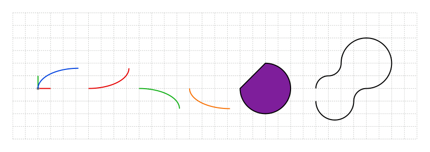


```python
import simetri.graphics as sg

canvas = sg.Canvas()

def curly_brace(pos, angle, length=100, radius=10):
    x, y = pos[:2]
    x1 = length /2
    y1 = 2 * radius
    half = sg.LinPath()
    half.arc(radius_x=radius, radius_y=radius, start_angle=sg.pi, span_angle=-sg.pi/2)
    half.forward(x1 - y1)
    half.arc(radius_x=radius, radius_y=radius, start_angle=3*sg.pi/2, span_angle=sg.pi/2)
    brace = half.mirror(half.right, reps=1)

    brace.rotate(angle, (x1, y1))
    x2 = x - (length / 2)
    y2 = y - (2*radius)
    brace.translate(x2, y2)

    return brace

canvas.help_lines(pos=(-50, -50), width=300, height=200, spacing=25)
brace = curly_brace((50, 50), sg.pi/4, length=150)
brace2 = curly_brace((200, 50), -sg.pi/6, length=100)

canvas.draw([brace, brace2], line_width=2)
canvas.display()
```


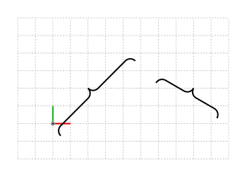


path.cubic_to(control1, control2, end)
:   `path.cubic_to` draws a cubic Bezier curve using the path's position, given control points, and the end point. Path objects can be transformed like any other Shape object.


```python
import simetri.graphics as sg

canvas = sg.Canvas()

canvas.help_lines(pos=(-50, -100), width=900, height=250, spacing=25)

path = sg.LinPath()
path.cubic_to((100, 100), (100, -50), (200, 0))
canvas.draw(path, line_width=2, handles=True)

path2 = sg.LinPath((250, 0))
path2.cubic_to((275, 100), (400, 75), (500, 0))
canvas.draw(path2, line_width=2, handles=True, line_color=sg.red)

path3 = sg.LinPath((550, 0))
path3.cubic_to((575, 100), (700, 75), (800, 0))
canvas.draw(path3, line_width=2, line_color=sg.blue)

shape = path3.mirror(sg.axis_x, reps=1).scale(.5, about=path3.center)
shape.translate(0, 75, reps=1)
canvas.draw(shape, line_width=2, line_color=sg.green)


canvas.display()
```


path.quad_to(control, end)
:   `path.quad_to` draws a quadratic Bezier curve using the path's position, given control point, and the end point.


```python
import simetri.graphics as sg

canvas = sg.Canvas()

canvas.help_lines(pos=(-50, -150), width=650, height=300, spacing=25)

path = sg.LinPath()
path.quad_to((100, 100), (300, 0))
canvas.draw(path, line_width=2, handles=True)

path = sg.LinPath((325, 0))
path.quad_to((525, -75), (500, 0))
canvas.draw(path, line_width=2, handles=True)


canvas.display()
```


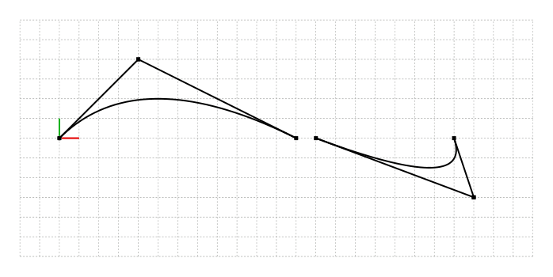


path.hobby_to(points)
:   Draws a Hobby curve through the given points.


```python
import simetri.graphics as sg

canvas = sg.Canvas()

canvas.help_lines(pos=(-50, -150), width=500, height=300, spacing=25)

path = sg.LinPath()

points = [(0, 0), (200, 100), (300, 50), (400, -50), (300, -100),
                (200, 0), (100, 50), (10, 0)]
path.hobby_to(points)
for p in points:
    canvas.circle(p, 3)

canvas.draw(path, line_width=2, handles=True)
canvas.display()
```


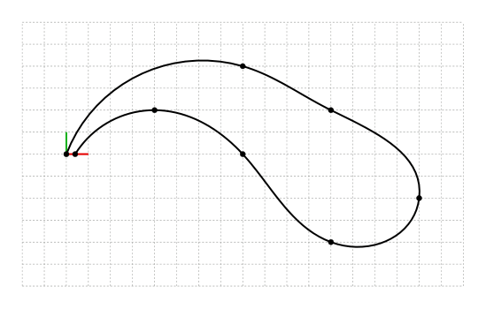


path.sine_to(period, amplitude, duration, phase_angle, damping)
:   `path.sine_to` draws a sine-wave using the given arguments.


```python
import simetri.graphics as sg

canvas = sg.Canvas()

canvas.help_lines(pos=(-50, -100), width=800, height=200, spacing=25)

path = sg.LinPath()
path.sine(period=50, amplitude=25, duration=150)
canvas.draw(path, line_width=2, line_color=sg.blue)

path2 = sg.LinPath((200, 0))
path2.sine(period=50, amplitude=25, duration=125, phase_angle=sg.pi/2)
canvas.draw(path2, line_width=2, line_color=sg.red)

path3 = sg.LinPath((350, 0))
path3.sine(period=20, amplitude=90, duration=350, damping=.005)
canvas.draw(path3, line_width=1.5)

canvas.display()
```


path.move_to(point)
:   `path.move_to` changes the path's position without drawing a line.


```python
import simetri.graphics as sg

canvas = sg.Canvas()

canvas.help_lines(pos=(-50, -50), width=450, height=200, spacing=25)

path = sg.LinPath()
for i in range(5):
    path.h_line(75)
    c = (i + 1)
    path.move_to((c*75, c*25))


canvas.draw(path, line_width=2)
canvas.display()
```


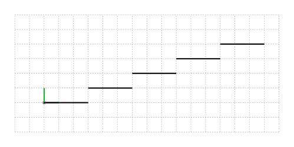


path.turn(angle, distance)
:   `path.turn` turns the path by the given angle (in radians) and moves it forward by the given distance. The angle is in radians and counterclockwise positive from the positive x-axis.


```python
import simetri.graphics as sg

canvas = sg.Canvas()

canvas.help_lines(pos=(-50, -50), width=300, height=200, spacing=25)

path = sg.LinPath()
path.forward(50)
path.turn(-sg.pi/4, 100)
path.turn(-sg.pi/2, 100)
canvas.draw(path, line_width=2)
canvas.display()
```


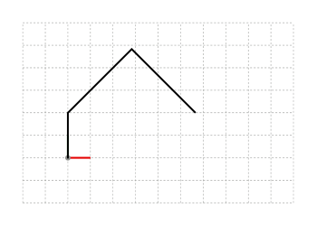


## Relative motions

For some path operations, we can specify the coordinates relative to the current path position.

New position is computed by adding dx to the path's x coordinate and dy to the path's y coordinate. Path's angle is ignored.

path.r_line(dx, dy)
:   `path.r_line` draws a line between the path's position and (dx, dy) offset from this position.
path.r_move(dx, dy)
:   `path.r_move` moves the path by the given offset values without drawing a line.


```python
import simetri.graphics as sg

canvas = sg.Canvas()

canvas.help_lines(pos=(-50, -50), width=450, height=150, spacing=25)

path = sg.LinPath()
for i in range(7):
    x = 40 - i * 5
    y = 40 - i * 5
    path.r_line(x, y)
    path.r_line(x, -y)

path.r_move(0, 50)

for i in range(7):
    x = 40 - i * 5
    y = 40 - i * 5
    path.r_line(-x, y)
    path.r_line(-x, -y)


canvas.draw(path, line_width=2)
canvas.display()
```


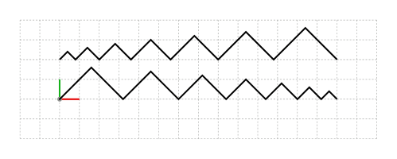


## Blended operations.

These operations blend the drawn lines to the path by using paths orientation angle.

path.blend_arc(radius_x, radius_y, start_angle, span_angle, sharp=False)
:   Blends an arc to the path. If the `sharp` argument is True then blending is reversed by 180 degree.


```python
import simetri.graphics as sg

pi = sg.pi

canvas = sg.Canvas()

canvas.help_lines(pos=(-50, -50), width=500, height=175, spacing=25)

path = sg.LinPath()
path.angle = pi/4

path.forward(50)
canvas.circle(path.pos, 3, fill_color=sg.red, stroke=False)

path.blend_arc(radius_x=50, radius_y=25, start_angle=pi/2, span_angle=-2*pi/3)
canvas.circle(path.pos, 3, fill_color=sg.red, stroke=False)

path.blend_arc(radius_x=50, radius_y=25, start_angle=pi/2, span_angle=pi)
canvas.circle(path.pos, 3, fill_color=sg.red, stroke=False)

path.blend_arc(radius_x=80, radius_y=50, start_angle=0, span_angle=-5*pi/6)
canvas.circle(path.pos, 3, fill_color=sg.red, stroke=False)

path.blend_arc(radius_x=30, radius_y=30, start_angle=0, span_angle=-pi, sharp=True)
canvas.circle(path.pos, 3, fill_color=sg.red, stroke=False)

path.blend_arc(radius_x=60, radius_y=30, start_angle=0, span_angle=-pi, sharp=True)

canvas.draw(path, line_width=2)
canvas.display()
```


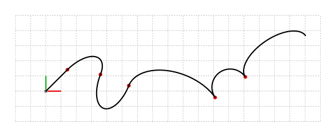


path.blend_cubic(control1_length, control2, end)
:   Blends a cubic Bezier curve to the path.

path.blend_quad(control_length, end)
:   Blends a quadratic Bezier curve to the path.


```python
import simetri.graphics as sg

pi = sg.pi

canvas = sg.Canvas()

canvas.help_lines(pos=(-50, -150), width=600, height=350, spacing=50)

path = sg.LinPath()
path.angle = pi/4

path.forward(100)
canvas.circle(path.pos, 3, fill_color=sg.red, stroke=False)

path.blend_cubic(150, (170, 80), (200, 0))
canvas.circle(path.pos, 3, fill_color=sg.red, stroke=False)

path.blend_cubic(100, (230, -50), (300, 0))
canvas.circle(path.pos, 3, fill_color=sg.red, stroke=False)

path.blend_quad(150, (400, 20))
canvas.circle(path.pos, 3, fill_color=sg.red, stroke=False)
path.blend_quad(50, (500, 0))

canvas.draw(path, line_width=2)
canvas.display()
```


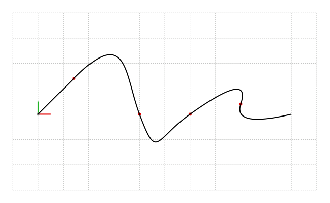


```python
import simetri.graphics as sg

canvas = sg.Canvas()

path = sg.LinPath()
path.cubic_to(control1=(20, 140), control2=(180, -40), end=(280, 60))
path.blend_cubic(control1_length=150, control2=(490, 100), end=(500, 0))

canvas.draw(path, handles=True)
canvas.display()
```


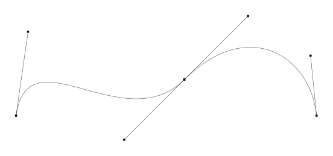


```python
import simetri.graphics as sg

canvas = sg.Canvas()

path = sg.LinPath((0, -40))
path.forward(40)
path.cubic_to(control1=(40, 160), control2=(140, 30), end=(180, 60))
path.blend_arc(radius_x=50, radius_y=20, start_angle=sg.radians(170), span_angle=sg.radians(200), sharp=True)
path.blend_cubic(control1_length=-70, control2=(470, 230), end=(540, 0))
path.v_line(-40)

paths = path.mirror(path.bottom, reps=1)

canvas.draw(paths, line_width=2, line_join=sg.LineJoin.BEVEL)

strings = sg.Shape([(0, -17.5), (500, -17.5)]).translate(0, -15, reps=3)
canvas.draw(strings, line_width=2)
canvas.line((500, -17.5), (500, -62.5), line_width=6)
canvas.display()
```


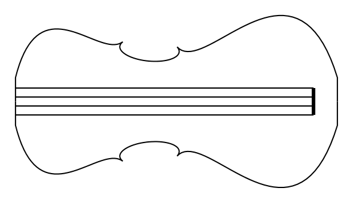


path.blend_sine(period, amplitude, duration, phase_angle, damping)
:   Blends a sine wave to the path.


```python
import simetri.graphics as sg

canvas = sg.Canvas()

canvas.help_lines(pos=(-50, -75), width=600, height=225, spacing=25)

path = sg.LinPath()
path.line_to((100, 100))
path.blend_sine(period=50, amplitude=25, duration=150)
path.blend_arc(radius_x=50, radius_y=50, start_angle=0, span_angle=-pi/2)
path.blend_arc(radius_x=100, radius_y=50, start_angle=0, span_angle=pi/2)
path.blend_sine(period=50, amplitude=25, duration=150)

canvas.draw(path, line_width=2, line_color=sg.blue)
canvas.display()
```


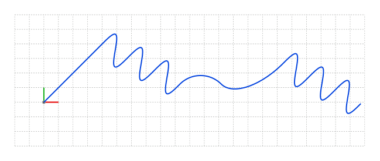


```python
import simetri.graphics as sg

canvas = sg.Canvas()

path = sg.LinPath()
path.forward(30)

path.blend_sine(amplitude=10, duration=200, damping=.01)
path.close()

paths = path.mirror([(0, 0), path.vertices[-2]], reps=1)
paths.mirror(paths.right, reps=1)
paths.mirror(paths.top, reps=1)

canvas.draw(paths)

canvas.display()
```


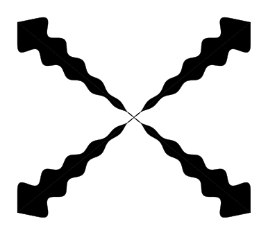


### Path utility functions

Path objects provides a number of utility functions to help with drawing and manipulating paths.
These include: `path.push`, `path.pop`, `path.r_coord`, and `path.r_polar`.

- `path.r_coord(dx, dy)`: Returns a position by offsetting the path's current position by `dx` and `dy` along the aligned axes to the path's angle (visualize a coordinate system with the origin at the path's position and the positive y-axis is aligned with the path's angle.
- `path.r_polar(r, theta)`: Returns a position by offsetting path's current position by `r * cos(theta)` and `r * sin(theta)` from the polar coordinate system with the origin at the path's position and the zero degree line oriented 90 degrees clockwise from the path's orientation angle.

!!! note "Unlike the `path.r_line` and `path.r_move` operations, `path.r_coord` and `path.r_polar` is computed by using the `path.angle`."

Path objects have a LIFO stack (last in first out) that holds (position, angle) tuples.

path.push
:   Pushes the path's position and angle to path's stack.

path.pop
:   Pops the position and angle values from the stack and applies them to the path object.

<div class="alert alert-bloc alert-info">
<b>Note:</b>  Unlike the <b>`path.r_line`</b> and <b>`path.r_move`</b> operations, <b>`path.r_coord`</b> and <b>`path.r_polar`</b> is computed by using the <b>`path.angle`</b>.
</div>


```python
import simetri.graphics as sg

canvas = sg.Canvas()
canvas.help_lines(pos=(-50, -50), width=200, height=200, spacing=25)

path = sg.LinPath()
print(f"path.pos: {path.pos}")
path.line_to((50, 50))
print(f"path.r_coord(20, -30): {path.r_coord(50, 50)}")
canvas.circle(path.r_coord(50, 50), 3, fill_color=sg.red, stroke=False)

path2 = sg.LinPath(path.pos)
path2.angle = path.angle
path2.push()

path2.forward(50)
path2.pop()
path2.angle -= pi/2
path2.forward(50)

canvas.draw(path)
canvas.draw(path2, line_width=2, line_color=sg.blue)

canvas.display()
```

    path.pos: (0, 0)
    path.r_coord(20, -30): (120.71067811865476, 50.0)


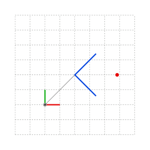


```python
import simetri.graphics as sg

canvas = sg.Canvas()

for i in range(4):
    path = sg.LinPath()
    path.angle = sg.radians(i * 90)
    path.forward(20)
    x, y = path.r_coord(50, 50) # y-axis is aligned with the path.angle
    canvas.circle((x, y), 3)
    print(f"path{i+1}.pos at first segment: {sg.round_point(path.pos)}")
    print(f"path{i+1}.angle: {sg.degrees(path.angle):.1f} degrees")
    print("x, y = path.r_coord(50, 50)")
    print(f"x: {x:.1f}, y: {y:.1f}")
    print('_' * 45)
    path.line_to((x, y))
    canvas.draw(path, line_width=2)
    canvas.text(f"path{i+1}", (0, -60), font_size=16)
    canvas.translate(150, 0)

canvas.display()
```

    path1.pos at first segment: (20.0, 0.0)
    path1.angle: 0.0 degrees
    x, y = path.r_coord(50, 50)
    x: 70.0, y: -50.0
    _____________________________________________
    path2.pos at first segment: (0.0, 20.0)
    path2.angle: 90.0 degrees
    x, y = path.r_coord(50, 50)
    x: 50.0, y: 70.0
    _____________________________________________
    path3.pos at first segment: (-20.0, 0.0)
    path3.angle: 180.0 degrees
    x, y = path.r_coord(50, 50)
    x: -70.0, y: 50.0
    _____________________________________________
    path4.pos at first segment: (-0.0, -20.0)
    path4.angle: -90.0 degrees
    x, y = path.r_coord(50, 50)
    x: -50.0, y: -70.0
    _____________________________________________


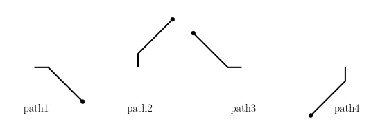


```python
from math import copysign

import simetri.graphics as sg

def flower(radius, canvas, path):
    canvas.circle(path.pos, 6, fill_color=sg.green)
    angle = sg.pi/6
    for i in range(9):
        x, y = path.r_polar(radius, (i*angle) - angle)[:2]
        canvas.circle((x, y), 2+i*.3, fill_color=sg.red)

canvas = sg.Canvas()
dim = 15
path = sg.LinPath()
path.forward(5 * dim)
path.push()
path.r_line(4 * dim, 4 * dim)
flower(dim, canvas, path)
dist = 3 * dim
for i in range(10):
    path.pop()
    sign = copysign(1, i%2 - 0.5) # -1 if i%2 else 1
    path.r_line(dim * sign , 2 * dim)
    path.push()
    delta = 4 * i
    path.r_line(sign * (dist - delta), dist - delta)
    flower(dim, canvas, path)

canvas.draw(path, line_width=3)
canvas.display()
```


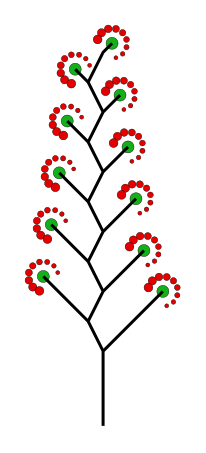
