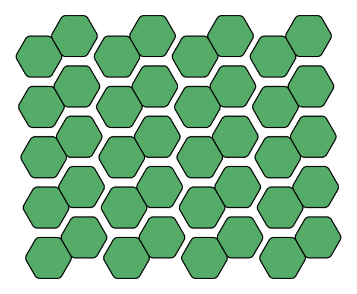
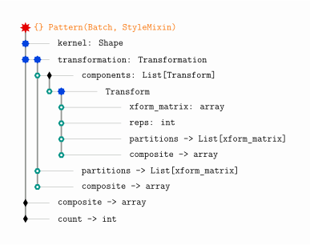

<div id="random-image-container2"></div>

# Patterns

Patterns are a mix of `Shape` and `Batch` objects. They are used to create large patterns with the same repeating shape. They have only one kernel (starting shape), a single style and a single composite transformation matrix. Unlike the regular transformation matrices this composite matrix has a size of (3 × 3𝑛) where 𝑛 is the number of distinct transformations. For example, if we mirror a shape with one repetition followed by a translation with three repetitions followed by another translation with four repetitions, the size of the composite transformation matrix would be:

$$n = (1 + 1)\cdot (3 + 1)\cdot (4 + 1)\cdot 3 = 120$$

```py
>>> import numpy as np
>>> import simetri.graphics as sg
>>> reps1, reps2, reps3 = 1, 3, 4
>>> hex = sg.reg_poly_shape(pos=(0, 0), n=6, r=40)
>>> hexes = sg.Pattern(hex)
>>> hexes.mirror(about=(hex[0], hex[1]), reps=reps1)
>>> hexes.translate(132, 0, reps=reps2)
>>> hexes.translate(-4, 85, reps=reps3)
>>> hexes.composite.shape
    (3, 120)
>>> (reps1 + 1) * (reps2 + 1) * (reps3 + 1) * 3
    120
>>> hexes.count # number of shapes in the pattern
    40
>>> vertices = hex.final_coords @ hexes.composite
>>> vertices.shape
    (6, 120)
>>> transformed = np.hsplit(vertices, hexes.count))
>>> transformed[0].shape
    (6, 3)
>>> transformed[0]
    array([[ 4.00000000e+01,  0.00000000e+00,  1.00000000e+00],
           [ 2.00000000e+01,  3.46410162e+01,  1.00000000e+00],
           [-2.00000000e+01,  3.46410162e+01,  1.00000000e+00],
           [-4.00000000e+01,  4.89858720e-15,  1.00000000e+00],
           [-2.00000000e+01, -3.46410162e+01,  1.00000000e+00],
           [ 2.00000000e+01, -3.46410162e+01,  1.00000000e+00]])
>>> canvas = sg.Canvas()
>>> canvas.draw(hexes, line_width=2, fill_color=sg.algae, fillet_radius=5,
            draw_fillets=True)
>>> canvas.save('/your/path/pattern_hex.svg', overwrite=True)
>>>
```

{ width="300" align="left"}

When we deal with very large patterns this structure is much more efficient than using `Batch` objects with multiple shapes in them. The `Batch` objects are more flexible and can be used to create more complex patterns. However, they are not as efficient as `Pattern` objects when it comes to rendering large patterns with the same repeating shape.

??? info "Patterns are still experimental."
    With the XeLaTeX backend, the main issue is the memory size that can be set, not the number of shapes. For very large patterns, 50-60 thousand shapes seem to be the limit.

    In the near future, at least for some cases, we will be able to draw patterns as images. Then patterns could be much more efficent than `Batch` objects. For now, we can use patterns with the XeLaTeX backend but we need to be careful about the number of shapes in them.

## Hierarchy of `Pattern` objects

{ width="500" align="left"}
