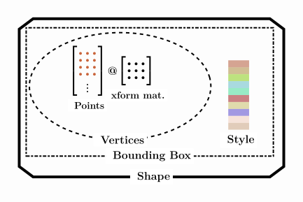

# Shape Objects

`Shape` objects are the fundamental data structure in SİMETRİ. They are used to represent geometric shapes as connected line segments ([polygonal chains](https://en.wikipedia.org/wiki/Polygonal_chain)). Each `Shape` object contains a set of vertices that define the shape's geometry, as well as a set of properties that define its appearance, such as fill-color, alpha, and line-width.

{ width="400" align="left"}
/// caption
The Structure of `Shape` objects.
///

We can create a `Shape` object by using:

`#!python sg.Shape(points: Sequence[Point] = None, closed: bool = False,
                                xform_matrix: array = None, **kwargs)`

If the first and last points are the same, the shape will be `#!python closed` and the last point will be discarded. If the first and last points are different, the shape will be 'open' unless we set the `#!python closed` property in the arguments to `#!python True`. This property can be modified after the object is created. If any other point pair other than the first and last points are the same, the Shape object will raise an error or issue a warning depending on the `defaults["allow_consec_dup_points"]` setting. The default value for this setting is `#!python False`. If we want to allow consecutive duplicate points, we can set it to `#!python True` using `#!python sg.defaults["allow_consec_dup_points"] = True`. This will allow us to create shapes with consecutive duplicate points without raising an error. This may create problems in some cases, so it is not recommended to use this setting unless we are sure that we need it.

!!! note "Consecutive duplicate points are not allowed in `Shape` objects, unless we change the default settings!"

## Modifying Shape Objects
Geometry of Shape objects can be modified by:

* Modifying its `primary_points`
* Modifying its `xform_matrix`
* Using Python list operations, indexing, or slicing.
* Transformations with zero repetitions.

### Using Python List Operations, Indexing, or Slicing

Modifying Shape Objects

Since Shape objects hold a sequence of 2D points the canonical data structure for this in Python is lists. So, Shape objects' points can be modified by using Python list operations (with some differences) and indexing.

!!! Note "Convention for sequences"
    We will use angle brackets for a sequence of objects. **`<points>`** means a list, tuple or Numpy array of points.

## List operations
append(point)
:   Add a point to the end of the points. If the Shape object is closed then when drawn this new appended point will be connected to the first point.

clear()
:   Remove all points from the Shape.

copy()
:   Return a copy of the Shape object. **Not just the points but the whole Shape object will be copied.** To copy just the vertices use `vertices_copy = shape.vertices`.

count(point, proxy=False)
:   By default it will use exact coordinates for comparison (by using RTOL and ATOL, see the [Numerical Issues] section). If the `proxy` argument is set to be True than it will search by using distances.

*[RTOL]: Relative tolerance for comparing floating point numbers.
*[ATOL]:  Absolute tolerance for comparing floating point numbers.

extend(<points> or Shape)
:   Add points from another sequence of points or Shape object to the end of the points. It will fail if this would cause redundant points in the Shape object.

index(point, start=0, end=None, proxy=False)
:   Return the index of the first occurrence of a specified point. By default it will use exact coordinates for comparison (by using RTOL and ATOL, see the [Numerical Issues] section). If the `proxy` argument is set to be True than it will search by using distances. It will raise a `ValueError` if the point is not found. The `start` and `end` arguments are optional and can be used to specify a range in which to search for the point.

insert(index, point)
:   Insert a point at a specified position. It will fail if this would cause redundant points in the Shape object.

pop(ind=-1)
:   Remove and return the point at the specified position (or the last point if no index is specified).

remove(point, proxy=False)
:   Remove the first occurrence of a specified point. By default it will use exact coordinates for comparison (by using RTOL and ATOL, see the [Numerical Issues] section). If the `proxy` argument is set to be True than it will search by using distances.

reverse()
:   Reverse the order of the points.

sort(key, reverse=False)
:   Sort the points in ascending order (by default) or in descending order by setting the `reverse` argument to be True. `key` is a function that takes an (x, y) tuple as an argument and returns a value that will be used for sorting. Unlike Python's sort method the key argument is not optional.

## Transforming Shape Objects
Shape objects can be translated, mirrored, rotated, scaled, and sheared. They have a method corresponding to each of these transformations. These methods modify the *xform_matrix* property of the Shape object. The *xform_matrix* is a 3x3 matrix (more precisely a numpy ndarray) that is used to transform the shape. The *xform_matrix* can be accessed and modified directly too.

None of these transformation methods change the *primary_points* of the Shape object. The *primary_points* are the points that define the shape in its original state. Since the vertices are computed by multiplying the *primary_points* with the *xform_matrix*, all transformations modify the vertices.

Transformations can be combined to apply multiple transformations to a shape. The order of the transformations matters. For example, if we rotate a shape and then translate it, the shape will be rotated around the origin and then translated. If we translate the shape first and then rotate it, the shape will be rotated around the translated origin.

## Composite Transformations
Combined (or chained) transformations are called composite transformations. They modify the Shape objects by applying multiple operations in a given order. The order of transformations may be significant depending on the type of transformations used. For example two consecutvie translations may be performed in any order but a translation followed by a rotation may give different results from a rotation followed by a translation.

There are three different ways we can perform composite transformations on Shape objects.

1. Apply individual transformations separately.
2. Apply individual transformations by using method chaining.
3. Matrix multiply the transformations to get a single transformation matrix and use this as an argument in the `transform` method'.

??? warning "Inconsistent mathematical convention!"
    Although there is no universally agreed upon convention on how composite transformations should be interpreted, almost all mathematicians (especially in the US) read the composite transformations from right to left. Our convention is the opposite (this is consistent with our Python code that uses row-major matrices). This is less surprising for non-mathematicians. Many old books and some foreign books use the left to right convention as well. As long as we are aware of the distinction this should be OK. The other reason for using our convention is about convenience. If we were to use column-major matrices we would have to be transposing coordinates back and forth and reading coordinates in column-major matrices does not feel natural.

## Transformations with Repetitions
In the previous examples we saw that applied transformations modified the shapes. When we transform a shape with multiple repetitions, the results will be very different. For each repetition a new Shape object will be created and the original Shape object will not be modified. Then the result will be a *Batch* object with the original Shape object and the new transformed Shape objects. The *Batch* object can be drawn with the *canvas.draw* method as well.

## Behind the Scenes
As we have seen above, transformations can be performed with or without repetitions. When we transform a Shape object without repetition we modify its `xform_matrix` according to the applied transformation. Shape object's `primary_points` property stays the same. Since the `vertices` property is computed by matrix multiplying `primary_points` and `xform_matrix`, vertices change accordingly as well.

When we apply a transformation with repetitions to a Shape object, this creates an empty Batch object and insert the original shape object (without any modifications) as well as the transformed copies of it. For example, applying a 30 degree rotation about the origin with two repetitions would create a new Batch with the original shape, a 30 degree rotated copy, and a 60 degree rotated copy of the original shape. Two repetitions mean three objects (original Shape object and two transformed copies) in a new Batch object.

!!! note "Transformations with repetitions do not alter the original shape."

##  Markers
Each point in a shape can be drawn with a marker. These markers can be indices of the vertices, coordinates of the vertices, a user provided sequence of string values, a sequence of Shape objects, a sequence of `Label` objects, an iterator that returns string values, or a function that has an `index` argument and returns a string value. Markers are explained in the [Cosmetic Features] section. If the `markers_only` property is True then edges are not drawn.

##  Cosmetic Features
Shape objects are drawn by the `Canvas` objects using their cosmetic properties as shown below.

* Line thickness: `shape.line_width`
* Line color: `shape.line_color`
* Line color transparency: `shape.line_alpha`
* Line join type: `shape.line_join`
* Line cap style: `shape.line_cap`
* Line miter limit: `shape.line_miter_limit`
* Line pattern: `shape.line_dash_array`
* Line pattern phase: `shape.line_dash_phase`
* Fill color: `shape.fill_color`
* Fill color transparency: `shape.fill_alpha`
* Fill pattern: `shape.fill_pattern`
* Shading: `shape.shading`
* Even odd rule: `shape.fill_mode`
* Filled: `shape.fill`
* Lined: `shape.stroke`
* Draw with markers: `shape.draw_markers`
* Marker: `shape.marker`
* Draw fillets: `shape.draw_fillets`
* Fillet radius: `shape.fillet_radius`
* Curved edges: `shape.smooth`