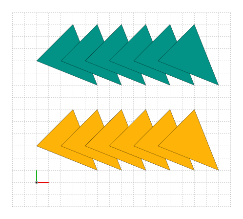
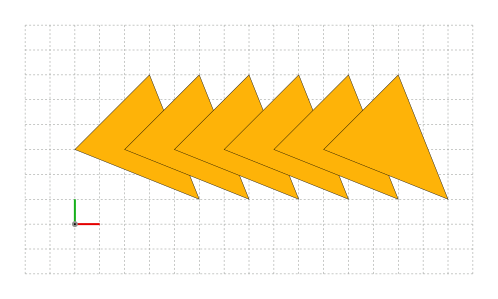
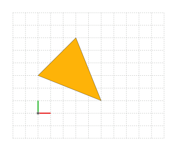

<div id="random-image-container2"></div>

# Transformations

Transformations are used to change the position, size, and orientation of shapes, paths, images, and batches. <br>In SİMETRİ, transformations are performed using transformation matrices. The transformation matrix is a mathematical representation of the transformation that can be applied to the points of the object.

Transformations can be performed successively by using repetitions. The number of repetitions can be specified using the `reps` argument. The default value is 0. This is a very powerful technique to create intricate patterns with ease.

!!! tip "When an object is not active, it cannot be transformed."

## Transformation Types

All `Shape`, `LinPath`, `Image`, and `Batch` objects can be transformed by using one of the following methods:

* `#!python translate(dx: float, dy: float, reps: int=0, key: Callable=None)`
* `#!python rotate(angle: float, about: Point, reps: int=0, key: Callable=None)`
* `#!python mirror(about: Line, reps: int=0, key: Callable=None)`
* `#!python scale(scale_x: float, scale_y: float, about: Point, reps: int=0, key: Callable=None)`
* `#!python glide(mirror_line: Line, distance: float, reps: int=0, key: Callable=None)`
* `#!python shear(angle_x: float, angle_y: float, reps: int=0, key: Callable=None)`
* `#!python transform(transform_matrix: array, reps: int=0, key: Callable=None)`

There is a special transformation method called `move_to` that can be used to move a shape, path, image, or batch object to a new position without changing its size or orientation. The `move_to` method moves the midpoint of the target object's boundary box to the specified position by default. This can be changed by specifying an anchor point. The `move_to` method has the following signature:

`#!python move_to(pos: Point, anchor: Anchor=sg.Anchor.CENTER)`

### Example:

- `#!python shape.glide(mirror_line=[(0, 0), (1, 1)], distance=45.5)`
- `#!python shape.scale(scale_x=1, scale_y=2.5)`
- `#!python shape.rotate(angle=sg.pi/4)`

## Composite Transformations

Composite transformations can be created by matrix-multiplying transformation matrices and then using the `transform` method. <br>SİMETRİ provides the following transformation matrices:

* `#!python identity_matrix() -> array`
* `#!python translation_matrix(dx: float, dy: float) -> array`
* `#!python rot_about_origin_matrix(angle: float) -> array`
* `#!python rotation_matrix(angle: float, about: Point) -> array`
* `#!python mirror_matrix(about: Line) -> array`
* `#!python scale_matrix(scale_x: float, scale_y: float, about: Point) -> array`
* `#!python scale_in_place_matrix(scale_x: float, scale_y: float, about: Point) -> array`
* `#!python glide_matrix(mirror_line: Line, distance: float) -> array`
* `#!python glide_in_place_matrix(mirror_line: Line, distance: float) -> array`
* `#!python shear_matrix(angle_x: float, angle_y: float) -> array`

And their inverse matrices:

* `#!python inv_translation_matrix(dx: float, dy: float) -> array`
* `#!python inv_rotation_matrix(angle: float, about: Point) -> array`
* `#!python inv_scale_matrix(scale_x: float, scale_y: float, about: Point) -> array`
* `#!python inv_glide_matrix(mirror_line: Line, distance: float) -> array`
* `#!python inv_shear_matrix(angle_x: float, angle_y: float) -> array`

??? note "There are no inverse matrices for `identity_matrix` and `mirror_matrix`!"
    Inverses of `identity_matrix` and `mirror_matrix` are themselves.

### Example:

```py title="Composite Transformations" linenums="1"
    import simetri.graphics as sg

    shape = sg.Shape(points=[(0, 0), (10, 10), (50, -30)])

    translation = sg.translation_matrix(10, 20)
    rotation = sg.rotation_matrix(sg.pi/4)
    scale = sg.scale_matrix(2)

    transform = translation @ rotation @ scale
    shape.transform(transform_matrix=transform, reps=2)

```


## Transformations Without Repetitions

Transformations without repetitions are used to modify an object's position, size, or orientation without creating multiple copies of the object. This is useful when you want to apply a transformation to an object without creating a pattern or repeating the transformation.

Since the default value of the `reps` argument is `0`, the transformation will be applied to the object without creating any copies.

### Transforming `Batch` Objects Without Repetitions

When we apply a transformation to a `Batch` object, the transformation will be applied to all the applicable items in the batch. The number of items in the batch will remain unchanged.

## Transformations With Repetitions

Transformations with repetitions are used to create multiple copies of an object with the same transformation applied to each copy successively. This is useful when you want to design a pattern of the target object.

The following snippet shows the equivalent way to create a pattern by using a Python loop.

```py title="Transformations with repetitions" linenums="1"
import simetri.graphics as sg

canvas = sg.Canvas()
s = 25 # scale factor
canvas.help_lines(pos=(-2*s, -2*s), width=18*s, height=16*s, spacing=s)

triangle = sg.Shape(points=[(0, 3*s), (3*s, 6*s), (5*s, s)], closed=True)

def translate_shape(shape, dx, dy, reps):
    batch = sg.Batch(shape)
    for _ in range(reps):
        shape = shape.copy()
        shape.translate(dx=dx, dy=dy)
        batch.append(shape)

    return batch

batch1 = translate_shape(triangle, dx=2*s, dy=0, reps=5)

triangle2 = triangle.copy()
batch2 = triangle2.translate(dx=2*s, dy=0, reps=5)

canvas.draw(batch1, fill_color=sg.amber)
canvas.translate(dx=0, dy=7*s)
canvas.draw(batch2, fill_color=sg.teal).display()
```
{ width="450px"}

## A Common Mistake

When we transform a `Shape` object with multiple repetitions, the result of this operation is a new `Batch` object with the original shape as well as the transformed copies of the original. This operation does not modify the original shape object. <br>
!!! note annotate "Multiple repetitions do not modify the original object."

If we apply a transformation with multiple repetitions to a `Batch` object, the transformed copies of the items in the batch will be added to the batch. The original items in the batch will remain unchanged.<br>
!!! note annotate "Transforming `Batch` objects with multiple repetitions grow them."

=== "`Shape` objects"

    ```py title="Transforming a `Shape` with repetitions" linenums="1"
    import simetri.graphics as sg

    canvas = sg.Canvas()

    s = 25 # scale factor
    canvas.help_lines(pos=(-2*s, -2*s), width=12*s, height=10*s, spacing=s)

    triangle = sg.Shape(points=[(0, 3*s), (3*s, 6*s), (5*s, s)], closed=True)
    triangle.translate(dx=2*s, dy=0, reps=5) # (1)!

    canvas.draw(triangle, fill_color=sg.amber).display()
    ```

    1. !!! warning annotate "A common mistake"
    Since the number of repetitions is not zero, the `translate` method does not modify the original shape object. It creates a new batch object with the original shape and the transformed copies of the original. The original shape object remains unchanged.<br>
    To capture the returned `Batch` object that contains the original and the transformed copies, use: <br>
    `#!python triangles = triangle.translate(dx=2*s, dy=0, reps=5)` <br>
    `#!python canvas.draw(triangles)`<br>
    Alternatively, if you don't need to reuse the returned `Batch` object, you can use:<br>
    `#!python canvas.draw(triangle.translate(dx=2*s, dy=0, reps=5))` <br>
    { width="450px"}

    { width="450px"}

=== "`Batch` objects"

    ```py title="Transforming a `Batch` object with repetitions" linenums="1"
    import simetri.graphics as sg

    canvas = sg.Canvas()

    s = 25 # scale factor
    canvas.help_lines(pos=(-2*s, -2*s), width=12*s, height=10*s, spacing=s)

    shape = sg.Shape(points=[(0, 3*s), (3*s, 6*s), (5*s, s)], closed=True)
    triangle = sg.Batch(shape)
    triangle.translate(dx=2*s, dy=0, reps=5) # (1)!

    canvas.draw(triangle, fill_color=sg.amber).display()
    ```

    1. !!! note annotate "Now the transformation is applied to a `Batch` object."

    { width="450px"}

??? note "We should be aware of the transformed object's type."
    The result may be different depending on the type of the object we are transforming.

For transformations of `Image` objects, see the [image-transformations](images.md#sec_image_transformations) section.